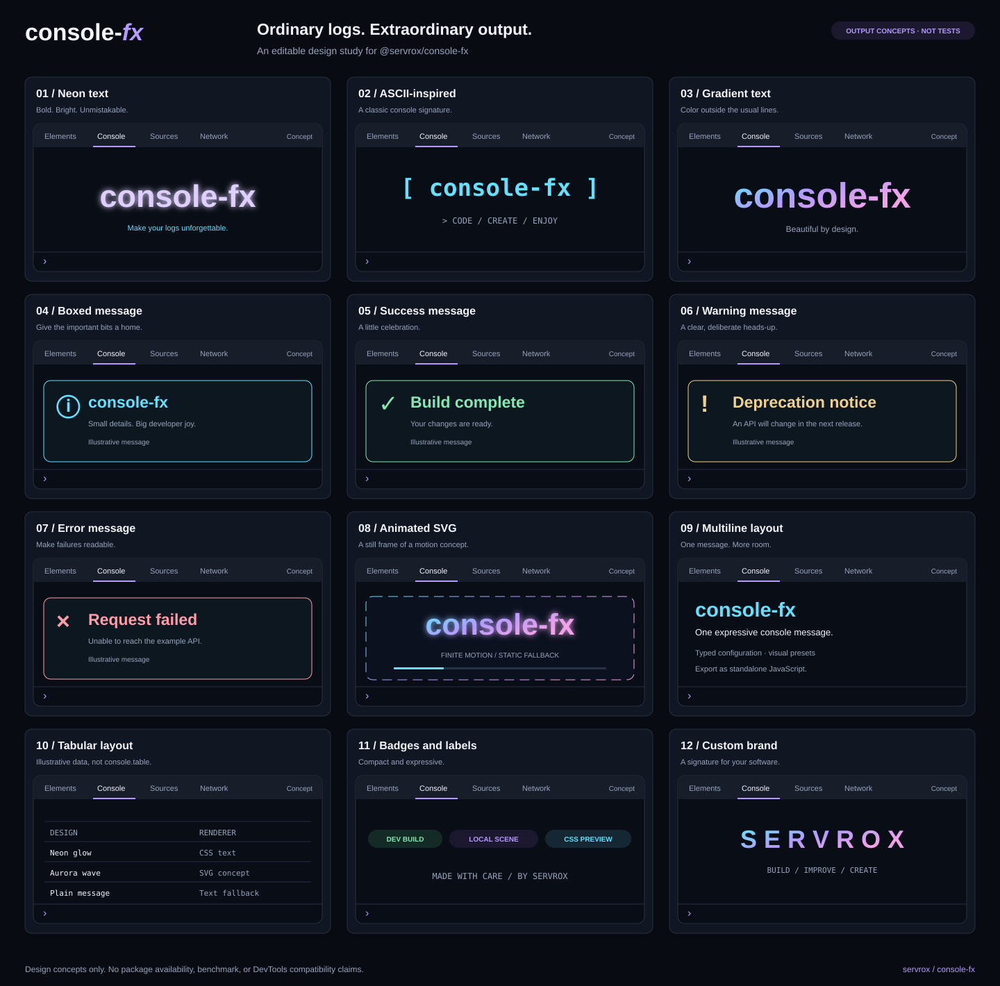
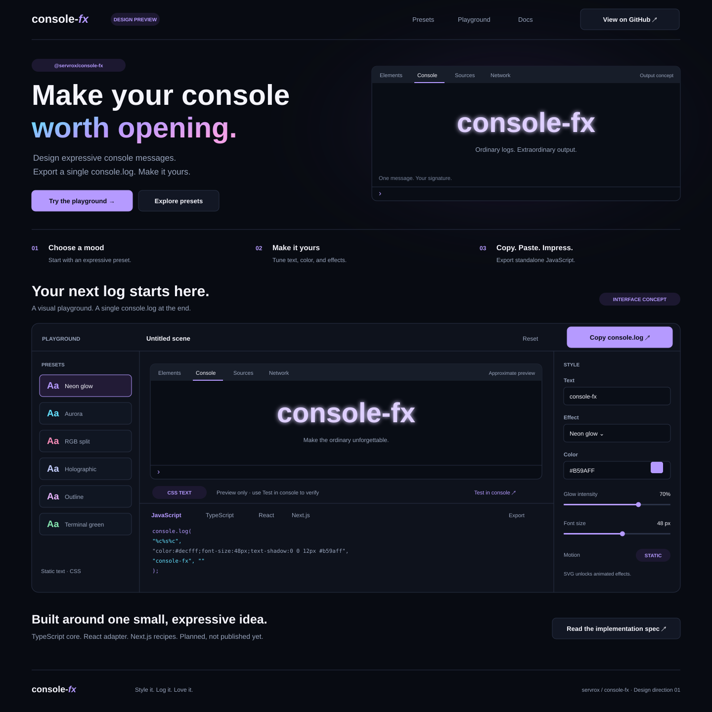
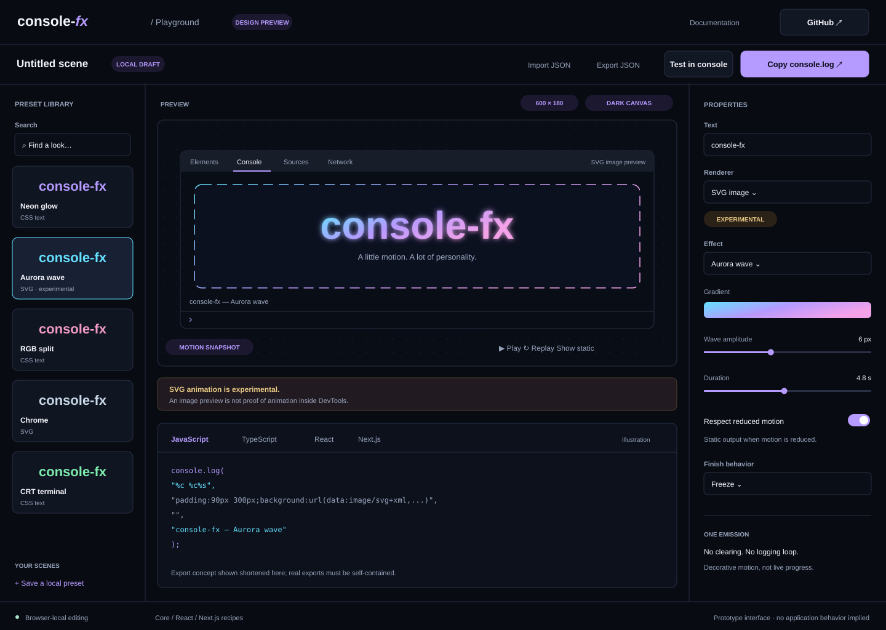
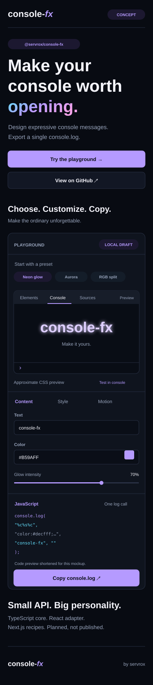

# console-fx

**Ordinary logs. Extraordinary output.**

A TypeScript library and visual studio for designing expressive browser-console messages and exporting a single, self-contained `console.log(...)`.

> **Status: core 0.1.0 published under `next`.** The core passed a registry-only installation check. React adapter publication is pending, and the deployed studio still requires Vercel sign-in. See the [release ledger](docs/releasing.md) and [browser compatibility record](docs/compatibility.md) for the boundaries of the available evidence.

[Implementation specification](docs/specs/console-fx-spec.md) · [Implementation handover](docs/specs/console-fx-handover.md) · [Mockup collection](docs/mockups/README.md)

## Install the core preview release

```sh
pnpm add @servrox/console-fx@next
```

The published 0.1.0 core matches the reviewed artifact and has no runtime dependencies. React examples currently require the source workspace while the adapter's publication is completed. Standalone exports need no installation.

## Run the studio locally

Use the pinned Linux toolchain: Node 24.20.0 and pnpm 12.3.4. Dependency install scripts are disabled by the workspace policy.

```sh
pnpm install --frozen-lockfile --ignore-scripts
pnpm build:packages
pnpm dev
```

Open the localhost URL printed by Next.js. Choose a preset, edit it, select the renderer, then copy the complete export. Editing is silent; **Test in console** emits exactly once. Valid local drafts resume automatically. JSON import/export and fragment sharing work without a server.

The default output is static plain text. Rich output requires an explicit Chromium target and CSS or SVG renderer. Each run supports one style effect and one optional motion. Motion lasts at most five seconds; printed images may keep a cached finished frame. Page previews and native DevTools have separate compatibility evidence.

```js
import { neon } from "@servrox/console-fx/presets";
import { emitConsole } from "@servrox/console-fx/browser";

emitConsole(neon({ text: "100% your message" }), {
  target: "chromium",
  renderer: "css",
});
```

The [core guide](packages/console-fx/README.md), [React guide](packages/console-fx-react/README.md), and [tested consumer examples](examples/README.md) cover public APIs and Next.js integration. ConsoleFX is [MIT licensed](LICENSE); the studio includes generated third-party notices.

## Cinematic Metal presets

The new **Cinematic Metal** collection adds Lightning Metal, Ice Cathedral, Liquid
Chrome and Molten Gold to the landing gallery and focused studio. These original
static SVG treatments have editable short titles, accent color, depth, glow and
ornaments. Angular titles support A–Z, digits, spaces and hyphens; local serif
profiles retain platform-dependent shaping. All titles are single-line and at most
24 code points. No film/studio affiliation or endorsement is implied.

Use `lightningMetal({ text: "BUILD 2026" })` from the existing presets export with
`{ target: "chromium", renderer: "svg" }`. The [core guide](packages/console-fx/README.md)
covers all four factories, diagnostics and explicit text fallback. The
[cinematic evidence](docs/specs/cinematic-metal-presets-evidence.md) records their
separate qualification status. Screen-reader review is nonblocking follow-up under
[ADR-0013](docs/adrs/0013-keep-screen-reader-review-as-nonblocking-follow-up.md).

## Validate a candidate

```sh
pnpm build
pnpm format:check
pnpm lint
pnpm typecheck
pnpm test
pnpm check:packages
pnpm check:bundle-size
pnpm prepare:vercel
pnpm test:studio
pnpm test:consumers
```

Browser checks need Playwright Chromium or the documented dedicated Windows CDP browser (`CONSOLE_FX_CDP_PORT`). Set `CONSOLE_FX_STUDIO_PORT` to test a separate local build. See [compatibility](docs/compatibility.md) for actual Windows DevTools qualification. CI configuration is present; local checks alone do not establish a successful remote run or release.

## Latest combined mockup

The current visual reference combines the landing page, console-output example gallery, and integrated playground in one screen.


**Design direction:** professional minimalism, harmonious dark neumorphic surfaces, and small cyan/neon accents rather than purple UI, large glowing panels, or decorative gradients. Expressive console-output examples sit inside a quieter interface. See the [design notes](docs/mockups/README.md) for implementation guidance.

This is an optimized raster of the latest generated mockup, not a redraw or a product screenshot. The version, GitHub star count, install command, example metrics, and abbreviated generated code pictured inside it are illustrative placeholders—not publication, performance, or compatibility claims. The specification remains authoritative for APIs and scope.

## Animated output example



The SVG preview animates for at most 4.8 seconds, then stops. It respects reduced-motion preferences. [Open the animation](docs/mockups/animated-output.svg) to replay it, or view the [static alternative](docs/mockups/animated-output-static.svg).

This is an animated image preview, **not a recording of Chrome DevTools**. Image rendering and console rendering must be validated separately.

### Try a dependency-free console prototype

Copy the complete [animated-console.js example](examples/animated-console.js) into your browser console. It emits one message containing a generated SVG background and a readable text caption. It does not install anything, fetch resources, alter the page, clear logs, or start JavaScript animation timers. Reduced-motion or an unknown motion preference selects static output.

Chrome documents `%c` styling and `data:` image URLs in its [console formatting guide](https://developer.chrome.com/docs/devtools/console/format-style). Animated SVG inside a particular DevTools version remains experimental. The example is exploratory source, not the future npm API.

## Earlier output concepts



An editable SVG reinterpretation of the initial concept gallery. Placeholder version numbers, performance metrics, and unplanned package claims from the original illustration have been removed. Tabular and status messages are decorative examples, not a proposed `console.table` or observability feature.

## Earlier landing page and playground explorations

The following editable SVGs are retained for reference. Their earlier color treatments do not override the current restrained, cyan-accented design direction shown above.

### Desktop landing page

The playground is part of the landing page: choose a preset, edit the content and styling, inspect the preview, and copy one `console.log`.



### Expanded playground

A focused workspace with preset library, output preview, export code, renderer settings, bounded motion, and explicit compatibility diagnostics.



### Mobile landing page



These are editable design mockups. Their buttons, fields, sliders, and exports are illustrations, not implemented controls. Code previews inside the SVG-mode and mobile mockups are explicitly shortened for presentation; real generated exports must be complete.

## Deliverables

| Deliverable | Name / location | Status |
| --- | --- | --- |
| TypeScript core | `@servrox/console-fx` | Published 0.1.0 under `next`; registry install verified |
| React adapter | `@servrox/console-fx-react` | Implemented; publication pending |
| Integrated Next.js studio | `apps/studio` | Implemented; launch checks pending |
| Next.js integration | `examples/next-app` | Isolated production consumer tested; no separate runtime package |

Compilation prints nothing. Explicit emission makes one console call. The core has no runtime dependencies. See the [specification](docs/specs/console-fx-spec.md) for the authoritative scope and release gates. The illustrations below and above retain their original design-prototype status.

## Design validation

The earlier SVG assets were rendered as images in headless Chromium 144.0.7559.96. Sampled frames confirmed visible animation, a still result after its duration, and a still result with reduced motion. The prototype console script was checked for a single emission and static fallback. This is **not** end-to-end DevTools UI validation, cross-browser certification, or a package release test.

The latest combined mockup is a compressed 1200 × 900 AVIF preview of the supplied 1448 × 1086 PNG. Its decoded image was visually inspected and its uploaded blob hash matched the prepared file. It is a static design reference; the earlier SVG and JavaScript validation does not establish behavior for controls drawn in this image.

The earlier illustrations remain self-contained SVG source, alongside the new raster mockup. No remote fonts, embedded scripts, external image dependencies, application code, or CI changes were introduced by this mockup update.
