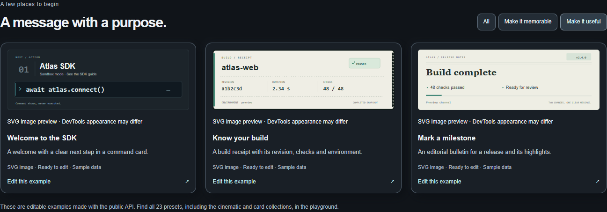

# Distinct Useful homepage examples

Date: 2026-09-13. Source base: `485882a513d0da2e5545c89ea1e5565bec893232`.
Owner: ConsoleFX maintainer; implementation and verification by Codex.

The maintainer reported that the Useful messages looked alike. Native Windows
Chrome inspection of the public homepage reproduced three instances of the same
three-line badge composition. The approved utility profiles were available in the
playground, but the landing examples still used their earlier generic scenes.

The shared landing recipe now uses the public Command Card, Build Receipt and
Release Bulletin factories. The SDK card has an inset command, the receipt has
aligned build facts and a tear edge, and the bulletin uses an editorial headline
and two highlights. Facts are fictional and marked as sample data. The depicted
SDK command remains inert text. Preview, comparison, export and editor transfer
consume the same scene. The card's own surface replaces redundant preview padding.

These are the existing 720 × 240 profile algorithms. Gallery thumbnails scale to
their available page space; this does not promise native-size thumbnail text or
new compact fitting behavior. No shared schema, renderer, package, dependency,
accepted profile or storage behavior changed. ADR-0002, ADR-0004, ADR-0007,
ADR-0009, ADR-0010 and ADR-0014 materially govern this correction.

## Local verification

- Production build and Vercel artifact preparation passed (`pnpm run build:vercel`).
- Workspace typechecking, changed-file lint/format checks and diff checks passed.
- Both existing example contract tests passed: complete plain/styled text and
  one-call exports, including literal percent and Unicode handling.
- The fourteen existing homepage cases passed at desktop and phone-sized viewports.
  Six new card cases then passed after correcting their assertion to read the
  recipe key; the legacy draft key deliberately retains the earlier scene.
- The new cases verify each named profile, exact gallery/workflow SVG, plain text,
  both affected hero choices and heading edits, confirmed transfer, export, Undo,
  preserved legacy draft and no automatic emission.
- Independent Spec and Standards reviews reported zero actionable findings.

Environment: NixOS WSL2, Node 24.20.0, pnpm 12.3.4, Playwright 1.63.0; native
Windows Chrome 153.0.8010.36 in owned contexts. Viewports: 1440 × 1000 and
390 × 664 CSS pixels (Playwright iPhone 13 descriptor). This is local browser
evidence, not a physical-phone, Safari, user-study or new DevTools qualification.
Existing qualification of the unchanged presentation algorithms retains its
original scope. The original dirty checkout and index remain protected.



[Phone-sized capture](mobile.png). Captures contain only ConsoleFX synthetic
examples and interface content, with no browser chrome, credentials or user data.

Logs and hero captures are retained locally under `.artifacts/review/useful-examples/`
and `.artifacts/website/states/useful-*`. The local section above preserves the
original pre-publication checkpoint. Later stages follow separately.

## Release checkpoint

[PR #19](https://github.com/servrox/console-fx/pull/19) merged source
`1ef9e376ba16660b8fa34610c6f4a1af646925dd` as
`30fc38613277acabbe3ccec922bc4fc37c395642`. The source/main tree is identical.
Both [PR CI](https://github.com/servrox/console-fx/actions/runs/34749665604) and
[main CI](https://github.com/servrox/console-fx/actions/runs/34749938206) passed.

The [release receipt](release.json) records the protected source preview and the
automatic Git production deployment `dpl_29n1fHmSUmitbxUJ9CtfKFtQMBAd` observed
on September 13. Both passed thirteen hosted journeys, including all three
replacement Useful previews, plain text, editor transfer/export/Undo and affected
hero choices. Routes, CSP, recovery and the 44.5-second video also passed, with no
CSP/page errors. Forty sampled served files were fingerprinted; this is not a
complete independently downloaded remote artifact hash. All three public domains
followed the main deployment. Preview and immutable URLs remained authenticated,
and the temporary preview share was revoked. These are dated observations; later
main pushes advance the public domains. No package was republished.

## Exact featured snippets in native DevTools

WVS-17 requires the featured snippets themselves to have native evidence. The
homepage checks above did not provide it. On September 13, the archived
harness executed each exact
export in owned Windows Chrome and Edge **native Console prompts**, using a blank
fixture with no page scripts or images. It located the native frontend by the
fixture's exact DevTools target ID, captured it, restored the original theme and
closed its owned surfaces. Run the [current runner](../../../../scripts/qualify-featured-useful.mjs)
from the repository root after
`pnpm run build:packages`, sequentially against dedicated Windows CDP instances:

```sh
node scripts/qualify-featured-useful.mjs 9344 chrome .artifacts/useful-native-chrome-new
node scripts/qualify-featured-useful.mjs 9348 edge .artifacts/useful-native-edge-new
```

Each destination must be new. Capturing ends with appearance review pending;
inspect the saved Console and plate images before recording a reviewed verdict.

The [raw archive](native/observations.tar.gz), [file manifest](native/manifest.json)
and separate [appearance review](native/review.json) retain exact scenes, options,
compiler output, standalone source, call counts, bounds, captions, versions,
timestamps, hashes and all 24 images. The harness and source replay are archived
with their exact bytes. The fixture fingerprint is `12d7560b…`; fresh package
rebuilding and equality assertions also matched all three complete outputs and
standalone snippets. That replay is source/static evidence.

| Browser / OS | Actual Console setup | Result |
| --- | --- | --- |
| Chrome 153.0.8010.36 / Windows 11 Pro Insider Preview 10.0.26220 | Light and Dark; 100% native zoom; DPR 1; Console width 1384 px | All three snippets: one call, exact arguments, complete readable caption, unclipped 720 × 240 card |
| Edge 153.0.4234.32 / same recorded Windows build | Light and Dark; 100% native zoom; DPR 1; Console width 1384 px | Same six-case pass |

Codex inspected every plate and complete Console capture. Command Card, Build
Receipt and Release Bulletin keep their distinct geometry and all sample fields
are readable in both themes. The raw reports deliberately retain their initial
appearance-pending status; `review.json` records the subsequent verified review.
All archive images and inputs contain only synthetic ConsoleFX content and the
owned DevTools interface; no unrelated tabs, credentials or participant material.
An initial Chrome attachment race failed before executing any sample and is
excluded from qualification. Its corrected exact-target polling is in the retained
harness. A source-replay metadata subprocess hit the local sandbox restriction;
the retained replay avoids that subprocess and passed.

Post-capture Standards review found that an early cleanup rejection could skip
later resources. The current runner now attempts every close in order and retains
the original failure alongside cleanup errors. The [failure-injection probe](native/cleanup-check.mjs)
passed [ten scenarios](native/runner-checks.json), including failed context/observer
closure, theme restoration, and report saving, with an owned real loopback server.
Run it from the repository root with
`node docs/evidence/website/2026-09-13-useful/native/cleanup-check.mjs`.
This is source/static recovery evidence. The archived executed harness and raw
capture hashes stay unchanged; the runner-check receipt identifies the corrected
script separately. No new browser observation is inferred from this cleanup fix.

This closes WVS-17 for the three changed featured scenes. Unchanged featured
examples and guide snippets retain their [original qualification](../2026-09-12/README.md#actual-native-output).
The [existing profile ledger](../../../specs/useful-artful-presets-evidence.md)
retains its separate lifecycle, narrow-console, zoom and clipboard scope. This
follow-up adds no motion, Safari, physical-device, participant or screen-reader
observation. Changes to output or the tested environment require affected evidence
review under ADR-0006 and ADR-0009; ADR-0002, ADR-0004, ADR-0010 and ADR-0014 also
govern this follow-up. The [completion audit](../../../specs/mvp-completion-audit.md)
keeps the three external requirements open.
