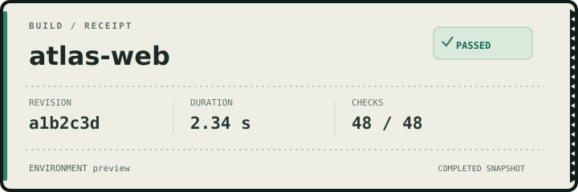
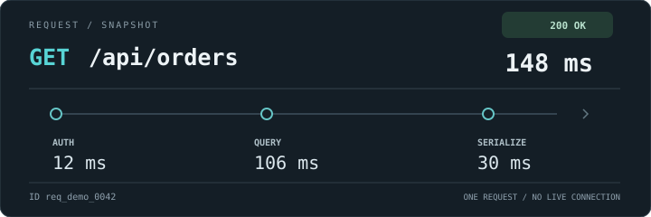
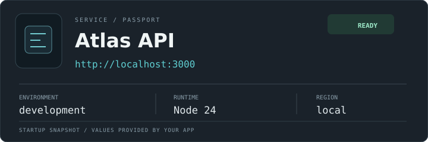
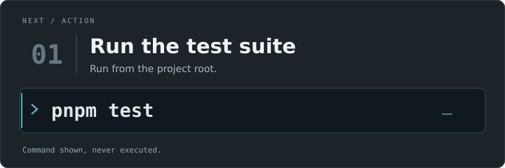
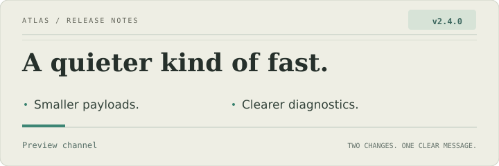
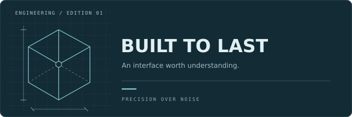
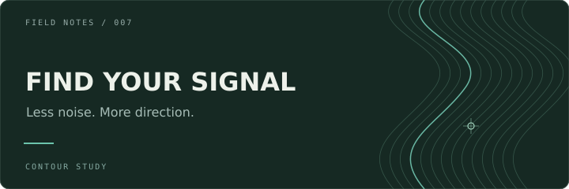
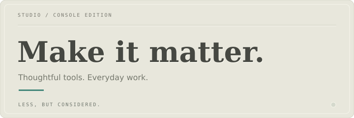
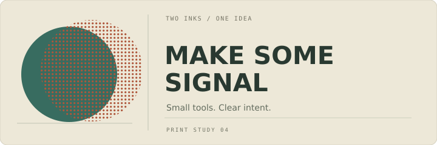
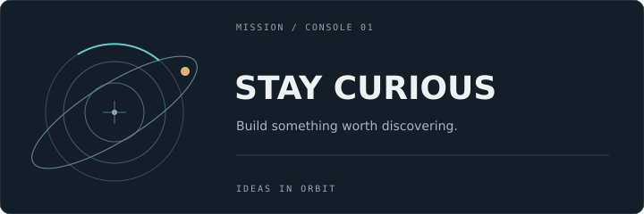

# Useful + artful preset references

**Design proposals, not current ConsoleFX output.** All sample facts are fictional. Each plate is 720 × 240 CSS px, static, self-contained SVG. These are individually reviewable comparison targets, not proof of DevTools rendering.

[Implementation spec](../../specs/useful-artful-presets-spec.md) · [Comparison procedure](comparison.md) · [Fixed fixtures](fixtures.json) · [Reference fingerprints](sha256.json)

| Useful / Artful | Useful / Artful |
| --- | --- |
| **Build Receipt**<br> | **Request Trace**<br> |
| **Service Passport**<br> | **Command Card**<br> |
| **Release Bulletin**<br> | **Blueprint**<br> |
| **Contour Map**<br> | **Letterpress**<br> |
| **Signal Halftone**<br> | **Orbital**<br> |

The SVGs are the editable source. Every semantic text element carries a `data-slot` identifier matching `fixtures.json`; decorative emboss duplicates are excluded. Shape coordinates and typography remain visible in the source. No font files are included.

## 1. Build Receipt

`buildReceipt` · `buildReceipt/v1` · **Useful** · SVG/static


**Use:** A build or deployment completion receipt, supplied by the caller.

**Editable inputs:** `project`, `outcome`, `revision`, `duration`, `checks`, `environment`, `accent`. Other profile typography is exposed only where the shared descriptor supports it.

**Comparison landmarks:** Paper-colored receipt with a narrow teal spine; Three aligned fact columns; Dashed horizontal separators and shallow tear edge.

**Acceptance:** Status is text plus an icon, never color alone. No test or deployment command is executed. All six supplied facts survive the readable caption.

Fixed example input (proposed factory options; not a current SceneV1 document):

```json
{
  "project": "atlas-web",
  "outcome": "PASSED",
  "revision": "a1b2c3d",
  "duration": "2.34 s",
  "checks": "48 / 48",
  "environment": "preview"
}
```

Reference: [buildReceipt.svg](buildReceipt.svg) · Semantic slots: `fixtures.json → presets[id=buildReceipt].text`

## 2. Request Trace

`requestTrace` · `requestTrace/v1` · **Useful** · SVG/static


**Use:** A one-request summary with caller-provided stage durations; not live tracing.

**Editable inputs:** `method`, `path`, `status`, `total`, `stages (three)`, `requestId`, `accent`, `tone`. Other profile typography is exposed only where the shared descriptor supports it.

**Comparison landmarks:** Three ordered nodes on a horizontal line; Total latency aligned at upper right; Cyan highlights only on method and trace nodes.

**Acceptance:** Node spacing represents order, not duration or proportional time. Do not derive success from HTTP text or silently recompute the total. Identifiers and paths are supplied explicitly; never inspect network requests.

Fixed example input (proposed factory options; not a current SceneV1 document):

```json
{
  "method": "GET",
  "path": "/api/orders",
  "status": "200 OK",
  "total": "148 ms",
  "stages": [
    {"label": "AUTH", "duration": "12 ms"},
    {"label": "QUERY", "duration": "106 ms"},
    {"label": "SERIALIZE", "duration": "30 ms"}
  ],
  "requestId": "req_demo_0042",
  "tone": "success"
}
```

Reference: [requestTrace.svg](requestTrace.svg) · Semantic slots: `fixtures.json → presets[id=requestTrace].text`

## 3. Service Passport

`serviceReady` · `serviceReady/v1` · **Useful** · SVG/static


**Use:** A startup or environment summary with a readable local endpoint.

**Editable inputs:** `service`, `state`, `endpoint`, `environment`, `runtime`, `region`, `accent`. Other profile typography is exposed only where the shared descriptor supports it.

**Comparison landmarks:** Inset service monogram at the left; Three-column specification strip; Endpoint remains legible without a glow.

**Acceptance:** State is not a health probe and has no automatic refresh. Never expose environment variables, keys, or endpoints implicitly. Endpoint is rendered as inert text, not a network request.

Fixed example input (proposed factory options; not a current SceneV1 document):

```json
{
  "service": "Atlas API",
  "state": "READY",
  "endpoint": "http://localhost:3000",
  "environment": "development",
  "runtime": "Node 24",
  "region": "local"
}
```

Reference: [serviceReady.svg](serviceReady.svg) · Semantic slots: `fixtures.json → presets[id=serviceReady].text`

## 4. Command Card

`commandCard` · `commandCard/v1` · **Useful** · SVG/static


**Use:** A prominent next step for onboarding, recovery, or a local workflow.

**Editable inputs:** `step`, `title`, `command`, `instruction`, `safety`, `accent`. Other profile typography is exposed only where the shared descriptor supports it.

**Comparison landmarks:** Inset full-width command well; Large muted step number, small cyan prompt; No fake Copy or Run button inside the console image.

**Acceptance:** Commands, including percent tokens and quotes, stay literal in output. Only the app export action is interactive; the console card executes nothing. Long commands get a diagnostic or explicit text fallback, not silent truncation.

Fixed example input (proposed factory options; not a current SceneV1 document):

```json
{
  "step": "01",
  "title": "Run the test suite",
  "command": "pnpm test",
  "instruction": "Run from the project root.",
  "safety": "Command shown, never executed."
}
```

Reference: [commandCard.svg](commandCard.svg) · Semantic slots: `fixtures.json → presets[id=commandCard].text`

## 5. Release Bulletin

`releaseBulletin` · `releaseBulletin/v1` · **Useful** · SVG/static


**Use:** A concise release announcement with two caller-supplied highlights.

**Editable inputs:** `product`, `version`, `headline`, `changes (two)`, `channel`, `accent`. Other profile typography is exposed only where the shared descriptor supports it.

**Comparison landmarks:** Editorial cream paper and serif headline; Version tag separate from headline; Two short highlights above a narrow footer rule.

**Acceptance:** No release notes, version, or performance claim is inferred. The two changes are text; do not add a feed or Markdown/HTML renderer. Body and version contrast must survive light and dark console surroundings.

Fixed example input (proposed factory options; not a current SceneV1 document):

```json
{
  "product": "ATLAS",
  "version": "v2.4.0",
  "headline": "A quieter kind of fast.",
  "changes": [
    "Smaller payloads.",
    "Clearer diagnostics."
  ],
  "channel": "Preview channel"
}
```

Reference: [releaseBulletin.svg](releaseBulletin.svg) · Semantic slots: `fixtures.json → presets[id=releaseBulletin].text`

## 6. Blueprint

`blueprint` · `blueprint/v1` · **Artful** · SVG/static


**Use:** A technical signature for an SDK, toolchain, or engineering team.

**Editable inputs:** `title`, `subtitle`, `eyebrow`, `footer`, `accent`, `detail`. Other profile typography is exposed only where the shared descriptor supports it.

**Comparison landmarks:** Original isometric cube construction, not a brand logo; Sparse drafting grid and dimension ticks; Title to the right, geometry stays clear of the letters.

**Acceptance:** Geometry is decorative, not a measured architecture diagram. Disable or reduce decoration in forced-colors/text fallback instead of hiding the message. Grid line density remains bounded; no canvas or WebGL.

Fixed example input (proposed factory options; not a current SceneV1 document):

```json
{
  "title": "BUILT TO LAST",
  "subtitle": "An interface worth understanding.",
  "eyebrow": "ENGINEERING / EDITION 01",
  "footer": "PRECISION OVER NOISE"
}
```

Reference: [blueprint.svg](blueprint.svg) · Semantic slots: `fixtures.json → presets[id=blueprint].text`

## 7. Contour Map

`contourMap` · `contourMap/v1` · **Artful** · SVG/static


**Use:** A calm geographical metaphor for a developer or product signature.

**Editable inputs:** `title`, `subtitle`, `eyebrow`, `footer`, `accent`, `detail`. Other profile typography is exposed only where the shared descriptor supports it.

**Comparison landmarks:** Tightly bounded contour curves on the right half; One brighter cyan contour among muted lines; Dark quiet field behind the entire headline.

**Acceptance:** Fixed contours are not real geography, customer data, or a live waveform. No randomness at render time; profile version fixes the geometry. No curve crosses the title safe region.

Fixed example input (proposed factory options; not a current SceneV1 document):

```json
{
  "title": "FIND YOUR SIGNAL",
  "subtitle": "Less noise. More direction.",
  "eyebrow": "FIELD NOTES / 007",
  "footer": "CONTOUR STUDY"
}
```

Reference: [contourMap.svg](contourMap.svg) · Semantic slots: `fixtures.json → presets[id=contourMap].text`

## 8. Letterpress

`letterpress` · `letterpress/v1` · **Artful** · SVG/static


**Use:** A tactile, understated welcome for a craft-focused tool or team.

**Editable inputs:** `title`, `subtitle`, `eyebrow`, `footer`, `accent`, `detail`. Other profile typography is exposed only where the shared descriptor supports it.

**Comparison landmarks:** Warm pale paper with shallow recessed type; Single short teal rule; No glow, bevel-heavy chrome, particles, or colored gradients.

**Acceptance:** The inset effect must not reduce foreground readability. Emboss copies are decorative and excluded from the readable caption. Serif metrics vary by OS; do not ship font files or stretch glyphs.

Fixed example input (proposed factory options; not a current SceneV1 document):

```json
{
  "title": "Make it matter.",
  "subtitle": "Thoughtful tools. Everyday work.",
  "eyebrow": "STUDIO / CONSOLE EDITION",
  "footer": "LESS, BUT CONSIDERED."
}
```

Reference: [letterpress.svg](letterpress.svg) · Semantic slots: `fixtures.json → presets[id=letterpress].text`

## 9. Signal Halftone

`signalHalftone` · `signalHalftone/v1` · **Artful** · SVG/static


**Use:** A two-ink poster treatment for a creative coding project.

**Editable inputs:** `title`, `subtitle`, `eyebrow`, `footer`, `accent`, `detail`. Other profile typography is exposed only where the shared descriptor supports it.

**Comparison landmarks:** Teal disc with a burnt-orange offset halftone overprint; Two-line sans headline on paper; Clearly separate overlapping inks; no blur or neon haze.

**Acceptance:** Line break is an explicit layout slot, not hidden text rewriting. Dots remain a bounded internal pattern; no noise images or external texture. Misregistration is visual only; the original text is preserved.

Fixed example input (proposed factory options; not a current SceneV1 document):

```json
{
  "title": "MAKE SOME\nSIGNAL",
  "subtitle": "Small tools. Clear intent.",
  "eyebrow": "TWO INKS / ONE IDEA",
  "footer": "PRINT STUDY 04"
}
```

Reference: [signalHalftone.svg](signalHalftone.svg) · Semantic slots: `fixtures.json → presets[id=signalHalftone].text`

## 10. Orbital

`orbital` · `orbital/v1` · **Artful** · SVG/static


**Use:** A restrained mission-card signature for a runtime or product.

**Editable inputs:** `title`, `subtitle`, `eyebrow`, `footer`, `accent`, `detail`. Other profile typography is exposed only where the shared descriptor supports it.

**Comparison landmarks:** Three concentric orbital rings, one inclined ellipse, and a single amber satellite; Sparse cyan arc and a tiny center cross; Static graphic with a spacious text column.

**Acceptance:** No animation or live-system implication. Rings and dot positions are deterministic profile-owned geometry. Readable text survives the no-graphics fallback without a meaningless icon-only message.

Fixed example input (proposed factory options; not a current SceneV1 document):

```json
{
  "title": "STAY CURIOUS",
  "subtitle": "Build something worth discovering.",
  "eyebrow": "MISSION / CONSOLE 01",
  "footer": "IDEAS IN ORBIT"
}
```

Reference: [orbital.svg](orbital.svg) · Semantic slots: `fixtures.json → presets[id=orbital].text`

## Shared acceptance

All fields remain editable through the one shared scene model after implementation. No ambient reads, arithmetic, command execution, logging on edit, hidden truncation, remote fonts, or animation. Do not substitute a mockup image for a runtime renderer. Every reference needs semantic, layout, and actual DevTools comparison before support is claimed. The surrounding editor retains minimal dark neumorphism with small cyan accents, not these output textures.
