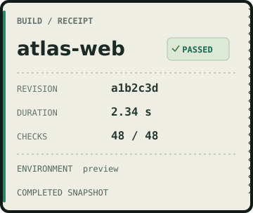
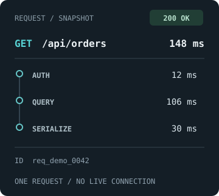
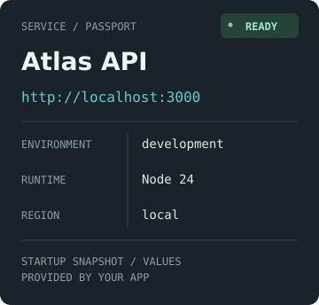
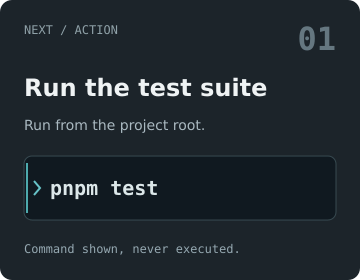
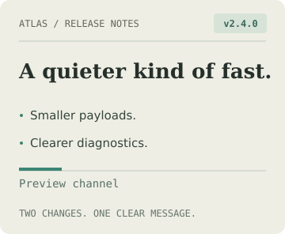
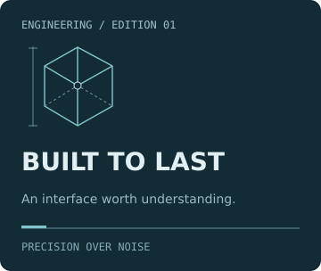
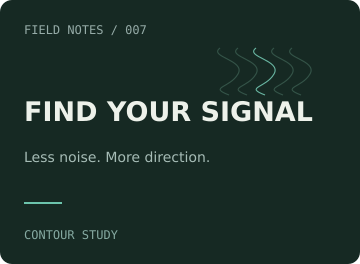
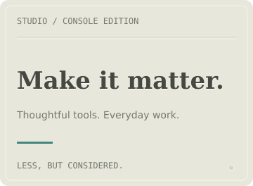
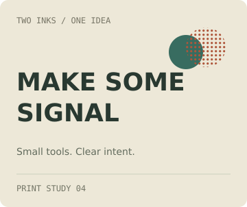

# Compact card design review

Status: **Accepted** under [ADR-0015](../../adrs/0015-separate-content-fit-from-output-sizing.md). On 2026-09-12 the maintainer explicitly answered “Approve all ten compact designs” after reviewing the captured overview and these individual references. This records visual acceptance; runtime implementation and native DevTools qualification require separate evidence.

All ten references are 360 CSS pixels wide, 264–344 high, with 12 px minimum text. They retain every supplied value from the [approved standard designs](../preset-collection-v1/README.md). Utility facts are stacked; artwork uses smaller ornaments and a separate text area. Service Passport's footer wraps into two visual lines without changing its text. The original 720 × 240 references and scene slots remain intact.

Each accepted `<preset>/compact/v1` recipe mapping applies only with explicit `fit/v1` options. It does not change the stored meaning of an existing `<preset>/v1` scene. Per-profile selection thresholds are recorded in [fixtures.json](fixtures.json); smaller/longer inputs still need an explicit measured fit or failure, not a promise of universal fit.

## Build Receipt

360 × 304; compact selection below 620 px.

## Request Trace

360 × 322; compact selection below 640 px.

## Service Passport

360 × 344; compact selection below 650 px.

## Command Card

360 × 280; compact selection below 590 px.

## Release Bulletin

360 × 296; compact selection below 610 px.

## Blueprint

360 × 304; compact selection below 610 px.

## Contour Map

360 × 264; compact selection below 580 px.

## Letterpress

360 × 264; compact selection below 520 px.

## Signal Halftone

360 × 302; compact selection below 560 px.

## Orbital

360 × 312; compact selection below 620 px.

The SVGs and their recorded hashes are immutable comparison targets. Their embedded proposal captions preserve the original review artifact. `prepare.mjs` intentionally refuses to overwrite an accepted fixture set; changes require a separately reviewed revision.
