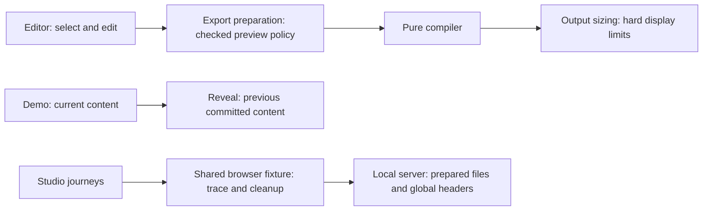

# ConsoleFX: six further architecture passes

**Six new passes found five code/test issues. Final review also fixed one
evidence issue. Each finding has its own fix.**

Requested by the maintainer on 2026-09-13 using
`improve-codebase-architecture`. This round starts at main `0dfd7c0`; it does
not reuse the [earlier six passes](architecture-improvements.md).
The reviews prioritize recently changed compiler, editor and release code.

## What each pass found

| Pass | Scope | Result | Separate fix |
| --- | --- | --- | --- |
| 1 | Studio preview, export preparation and editor | **R2-01:** Play could render with a motion policy that had not passed compilation. A valid static fitted scene could crash the editor. | `c59cc6e`: export preparation owns the checked static/animated preview; failed Play preserves the static preview, editable content and export. |
| 2 | Session, history, import and draft recovery | **No additional finding.** Import invalidation and recovery already have coherent owners. | Keep the existing modules and behavioral tests. |
| 3 | Core compilation, fitting, measurement preflight and sizing | **R2-02:** the planner classified a hard display-height violation as recoverable; output sizing classified the same violation as fatal. | `877480d`: remove the competing planner rejection. Output sizing enforces the hard limit; measurement preflight remains available. |
| 4 | Effect/preset data, named fields, compact variants and editor controls | **No additional finding.** Reviewed mappings agree; another shared interface would add complexity without removing a real obligation. | Keep current ownership and catalogue contract coverage. |
| 5 | React lifecycle and its interactive callers | **R2-03:** outgoing reveal content reused new input with an old selection. Editing valid Plain content past rich limits could crash the demo. | `5d250be`: retain the previously committed content within the reveal module. |
| 6 | Artifact, release and browser-test interfaces | **R2-04:** only two tests injected deployment CSP, leaving other journeys and assets outside the generated policy. **R2-05:** the no-JavaScript context bypassed native trace ownership and explicit failure cleanup. | `ec8d566`: serve the prepared artifact and global headers once. `0bebace`: move existing static-page assertions into the shared page fixture. |
| Final review | Durable evidence | **R2-06:** the initial summary omitted the commands, harness identity and invalidators required for reusable results. | The companion sanitized receipt records those inputs and outcomes; raw logs and traces remain local. |

No speculative refactors were added to make every pass produce a change.
Each pass has a temporary visual report with its findings, before/after view,
deletion test and proof owner. Durable evidence belongs in this document;
reports remain in `/tmp` and raw logs under `.artifacts/architecture-round-2/`.

## The resulting ownership

- **Locality:** the module that owns each operation also owns its policy or
  lifetime. Callers no longer coordinate a second, competing interpretation.
- **Leverage:** existing journeys inherit correct preview recovery, HTTP policy
  and diagnostics through the same small interfaces.
- **Deletion test:** deleting these owners would return policy or lifecycle
  plumbing to callers. No new public package interface is introduced.
- **Test ownership:** use Vitest 4 for input, compilation and mounted recovery;
  keep actual animation, CSP, navigation and clipboard checks in Playwright.

## Validation

Source candidate: `365ae36`. The final build caught an unsupported Testing
Library query option in the new regression; that option was removed in this
commit. It did not change application behavior.

The [machine-readable verification receipt](architecture-round-2-verification.json)
records exact commands, observation times, input/lockfile/artifact hashes,
toolchain, environments, proof owners and invalidators. It includes the complete
temporary failure-probe configuration and test for reproduction. Each
observation names one evidence stage; local installs do not establish registry
publication. Raw log paths identify local files, not public evidence uploads.

| Proof | Result |
| --- | --- |
| Pass 1 preview interface | 8 tests passed. |
| Pass 3 fitting interface | 25 tests passed, including the expanded invalid-sizing matrix and useful preflight. |
| Pass 5 mounted demo recovery | 1 test passed. The existing real-browser page-effects journey owns animation-end cleanup. |
| Formatting, lint and TypeScript | Passed. |
| Final Vitest 4 unit and release projects | 345 tests passed across 22 files. |
| Package contents and bundle limits | Passed for both prepared 0.1.1 packages. |
| Prepared artifact | Build passed; 50 static files, five hashed inline scripts. Actual global HTTP headers match on landing, studio and JavaScript responses. |
| Studio browser suite | 86 passed: desktop and narrow layouts, including both new Play-failure cases and the two separately owned no-JavaScript cases. |
| Packed consumers | JavaScript, TypeScript declarations, React lifecycle, displayed recipes and Next production build passed; all three browser journeys passed. |
| Native failure diagnostics | A separate intentional failure retained four DOM snapshots and five loopback requests in the owned trace. No unrelated requests or screencast frames; zero test pages remained after teardown. |
| Independent Standards and Spec reviews | No actionable findings in the reviewed implementation. |
| GitHub CI and Git-triggered production | Separate post-commit checks; the local results above do not establish their outcome. |

Local browser environment: Chrome for Testing **153.0.8010.36**, headless via
CDP, on Windows 11 Pro Insider Preview **10.0.26220**. This is browser interaction
evidence, not a new actual-DevTools or current-stable OS qualification. The
dedicated browser used an isolated task profile; unrelated worktrees and indexes
were preserved.

The initial mounted test also tried to prove animation-end cleanup through a
synthetic JSDOM event. Its recovery assertions passed, but that event did not
exercise the real browser lifecycle. The redundant assertion was removed;
the existing browser proof owner remains. See the
[testing strategy](testing-strategy.md) for generalized coverage and milestone
cadence.

## Decisions and release limits

- Governing Accepted decisions: [ADR-0002](../adrs/0002-compile-purely-and-emit-exactly-once.md),
  [ADR-0004](../adrs/0004-separate-core-react-adapter-and-studio.md),
  [ADR-0005](../adrs/0005-generate-output-from-validated-data.md),
  [ADR-0007](../adrs/0007-keep-studio-documents-local.md),
  [ADR-0009](../adrs/0009-validate-changed-contracts-with-proportional-evidence.md)
  and [ADR-0015](../adrs/0015-separate-content-fit-from-output-sizing.md).
  No successor or new acceptance is needed for these internal corrections.
- Proposed ADR-0016/0017 remain pending. This round does not implement the
  proposed workbench or change saved-document or renderer defaults.
- A changeset records the core correction. The earlier 0.1.1 publication packet
  does not include it; publication needs a refreshed exact candidate and its
  separate [ADR-0010](../adrs/0010-deliver-reversible-phases-with-publication-gates.md)
  gate. Local tarballs do not establish npm publication.
- Browser automation is separate from actual DevTools qualification, physical
  device/Safari checks and participant sessions. The local server covers
  generated global headers, not Vercel routing, caching, protection or CDN
  behavior. Screen-reader review remains nonblocking under
  [ADR-0013](../adrs/0013-keep-screen-reader-review-as-nonblocking-follow-up.md).
