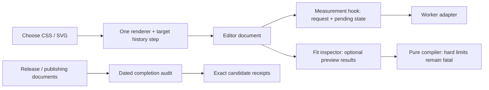

# ConsoleFX: third round of six architecture passes

**Six new passes found four issues. Each issue has a separate fix.**

Requested on September 13, 2026 using `improve-codebase-architecture`.
Baseline: main `77c6e3d`. Source candidate: `8e8d7d1`. These are new walks after
[round two](architecture-round-2.md), scoped by recent changes and actual callers.

## Findings and fixes

| Pass | Reviewed module / interface                                  | Result                                                                                                                                               | Separate commit                                                                                                                 |
| ---- | ------------------------------------------------------------ | ---------------------------------------------------------------------------------------------------------------------------------------------------- | ------------------------------------------------------------------------------------------------------------------------------- |
| 1    | Local measurement lifecycle and optional fitting previews    | **R3-01:** canceled work could reappear as permanently pending after Undo. **R3-02:** an oversized optional SVG reference could crash the inspector. | `d170842`: cancellation retires pending state. `f48d865`: all fitting attempts return recoverable compiler diagnostics.         |
| 2    | Document codecs, storage adapter and session transitions     | No additional finding. Validation, revisions and write ordering preserve valid work.                                                                 | No change justified.                                                                                                            |
| 3    | Core validation, read-only descriptors and output generation | No additional finding. Schema, capability and hard-limit failures retain distinct behavior.                                                          | No change justified.                                                                                                            |
| 4    | React lifecycle and editor controls                          | **R3-03:** selecting a Chromium renderer retained an imported Node/unknown target.                                                                   | `4f2cd4f`: commit the selected CSS/SVG renderer and Chromium target as one undoable change; Plain text preserves target intent. |
| 5    | Artifact verification and release evidence                   | **R3-04:** release documents called different historical candidates current.                                                                         | `8e8d7d1`: date old candidates and use the completion audit for checkpoint navigation.                                          |
| 6    | Landing interactions, example transfer and video             | No additional finding. Selection, clipboard, motion and transfer retain clear owners.                                                                | No change justified.                                                                                                            |

Every walk used the codebase-design vocabulary and deletion test. Six temporary
HTML reports include candidate diagrams and recommendations; they remain outside
the repository. The findings above are the complete list for this bounded round.

## What now owns the behavior

- **Locality:** each existing module owns the lifetime, policy or evidence it
  exposes. Pending means a live request; an optional preview failure stays local.
- **Leverage:** both renderer-selection callers inherit the compatible target
  and one-step Undo through their existing interface.
- **Deletion test:** a new policy wrapper would only move the selection rule.
  Removing competing current-status claims removes reader coordination instead.
- **Scope:** no public package interface, saved schema, renderer default or
  approved appearance changes. The core and React tarballs match round two.

## Test ownership and final verification

The [testing strategy](testing-strategy.md) keeps one proof owner per behavior.
Two parameterized Vitest hook cases cover scene/settings cancellation, Undo,
retry and late completion. One mounted inspector case covers hard-limit failure
and recovery through the real compiler. One browser journey covers both rich
renderer selections, exact export, Undo/Redo and silence on desktop/narrow views.
No per-style browser tours or private-helper snapshots were added.

The [verification receipt](architecture-round-3-verification.json) records
commands, source/input hashes, toolchain, environments, observation times,
proof owners and invalidators. Local logs remain in
`.artifacts/architecture-round-3/`; no raw captures or traces are published.
The final source gates, 348 Vitest cases, tarball/bundle checks and all 88 studio
browser cases pass. Isolated JS/TS/React consumers, the Next production build and all three packed
Next browser journeys also pass. Independent Standards and Spec reviews found
zero remaining issues in both the source candidate and final evidence documents.

The initial worker fixture imported a non-public normalizer; it now supplies a
typed worker result. The build then rejected its incomplete event cast;
`b7fd250` constructs a real typed `MessageEvent`. These fixture repairs do not
change package exports. Two browser starts found occupied ports before tests
ran; an OS-selected free port preserves those unrelated listeners.
The first full browser run passed 87 cases; one could not hydrate after Chrome
reported `ERR_NO_BUFFER_SPACE` for a required JavaScript chunk. The trace and
profile were retained. The unchanged affected journey and all 88 cases then
passed in a fresh owned browser. No retry policy, timeout, assertion or
application behavior was weakened.

## Decisions and remaining gates

Governing Accepted decisions: ADR-0002, ADR-0004, ADR-0005, ADR-0007, ADR-0009,
ADR-0010 and ADR-0015. These corrections preserve their intent; no successor is
needed. Proposed ADR-0016/0017 and the workbench implementation remain pending.

Local/CI browser checks do not replace actual DevTools qualification, physical
laptop/phone performance, Safari observations or participant sessions.
Screen-reader review remains nonblocking under ADR-0013. Registry metadata
checks still found both 0.1.1 versions absent; publication requires its separate
exact-candidate approval and subsequent registry verification.
