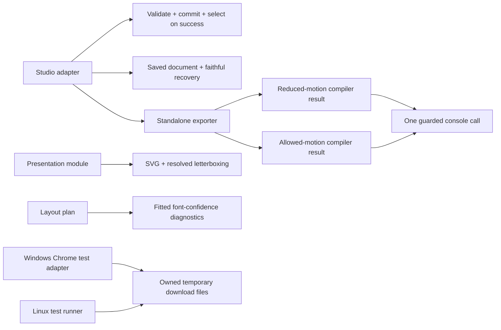

# ConsoleFX: fourth round of six architecture passes

**Six new walks found eight issues. Final verification found a test-adapter issue
and an evidence-provenance gap. Each has a separate fix.**

Requested September 13, 2026 with `improve-codebase-architecture`. Baseline:
`0799750c793107beab511b97495524f46b8c90a3`, the locally reviewed
[third round](architecture-round-3.md). This round preserves that candidate and
the earlier worktrees. Source, local verification and public integration have
separate status.

## Findings and separate fixes

| Pass | Finding | Result / commit |
| --- | --- | --- |
| 1: editing | R4-01: rejected additions moved selection | `c45b1f0`: validation, replacement and successful selection advancement share the existing commit interface. |
| 1: editing | R4-02: empty lines lost their removal control | `5400b75`: line removal belongs to the selected line; run controls belong to the selected run. |
| 2: export | R4-03: oversized recipe links recommended a scene-only backup | `6044f1b`: recovery names the export that retains the document's render settings. |
| 2: export | R4-04: download recovery named a nonexistent format | `3708f67`: guidance matches Scene JSON (content only). |
| 3: core/consumers | R4-05: standalone system motion discarded a nonanimated fallback branch | `8f0fbda`: preserve both compiler results and their diagnostics; select differing arguments through the existing media guard. |
| 4: fitting | R4-06: compact cards inherited the original 3:1 letterbox assumption | `525b734`: the presentation module returns letterbox status from its resolved geometry. |
| 4: fitting | R4-07: measured cards still claimed estimated slot widths | `9ce2258`: the layout plan owns fitted confidence; the legacy estimate note remains on the unfitted path. |
| 5: lifecycle | R4-08: storage failures recommended an incomplete backup | `33516f7`: recovery recommends recipe JSON, preserving scene and settings for either document kind. |
| 6: integration | No further source finding | Artifact identity, recovery, browser policy and test ownership remain localized. No additional extraction passed the deletion test. |
| Final verification | R4-09: Windows CDP downloads received a Linux destination | `7e1e8ba`: the native test adapter gives Chrome and the Linux runner access to the same owned temporary files; both download journeys verify actual bytes. |
| Evidence review | R4-10: bespoke checks lacked reproducible provenance | The documentation fix retains exact harnesses, artifact/fixture fingerprints and sanitized probe results; only the 33 deterministic comparisons needed another run. |

The walks also inspected descriptor-driven controls, React lifecycle, compiler
options, clipboard completion, measurements, draft holds, history, package
consumers and release receipts. Six temporary HTML reports provide before/after
diagrams; the verification finding has a separate addendum. They remain outside
the repository. No wholesale editor split or generic command framework was
justified.

## Ownership after the fixes

- **Depth:** existing interfaces own validation ordering, faithful recovery and
  complete compiler-result selection.
- **Locality:** presentation geometry and fitted confidence each have one owner.
- **Leverage:** scene and recipe downloads use the same native browser adapter;
  callers do not coordinate operating-system paths.
- **Deletion test:** removing these responsibilities would redistribute rules
  across callers. Further wrappers would only move the same code.

## Verification and test ownership

Follow the [testing strategy](testing-strategy.md): Vitest 4 for pure contracts,
browser journeys for interactions, checks at completed milestones.

- Extend the existing share-budget, storage-recovery, codegen parity and compact
  reference matrices. Keep legacy letterboxing and confidence coverage.
- Add two structural-edit journeys and one recipe-download recovery journey.
  Check selection/history and exact exported bytes through the user interface.
- Strengthen the existing scene download journey to read the complete file.
  Keep the application's download behavior unchanged.
- Independent Standards and Spec reviews cover the source changes, native
  adapter and fixture repairs. The final receipt records their conclusions.

The [verification receipt](architecture-round-4-verification.json) owns final
commands, source/input hashes, toolchain, environments, observation times,
results and invalidators. Raw local logs and traces remain under
`.artifacts/architecture-round-4/`; they are not part of the public source diff.

The initial confidence fixture assumed a fully estimated card would fit its
bounded cells. Conservative bearings and the standard type floor correctly
rejected it. `4a2ec30` uses a valid partial-measurement fixture to verify mixed
confidence. Production limits and confidence assertions are unchanged.

The first final browser run passed 92 of 94 cases. The two recipe download cases
failed with `download.createReadStream: canceled`. A four-case probe kept the
application-independent Blob content constant: immediate and retained URLs both
failed with the runner's Linux destination and both completed with a valid
Windows destination. A shared-directory probe then verified exact downloaded
bytes through Linux. A browser-owned CDP session keeps that destination active
after the temporary setup page closes; the test owns its context and files.
This establishes a native test-adapter defect; filename events alone had not
proved download completion. Failed traces are retained.

Final source checks also found formatting, a Playwright fixture lint exception,
and three test typing issues. `cb84542` documents the framework-required empty
dependency pattern. `5bf1628` copies the readonly matcher array, preserves tuple
types and rejects a missing owned browser-context ID before changing download
behavior. The assertions remain intact.

The final evidence review found missing provenance for the comparison and
download probes. The first comparison shared its result filename with the
receipt runner, which replaced its detailed output map. The correction separates
those destinations, retains all 33 scene/options/output fingerprints, and checks
both expanded compiler inputs against their exact tarballs. The receipt also
includes each probe's harness, command, time and result hash, with synthetic
outputs retained and private runtime paths removed. This evidence-only correction
does not change application code or add a recurring test gate.

Final source candidate: `5bf16285251ca451b437d0b05820df1dbdf5c5b1`.

- **Passed:** formatting, lint, types and 353 Vitest 4 cases across 24 files.
- **Passed:** all 94 desktop/narrow studio cases and three packed-consumer
  journeys, plus isolated JS/TS/React consumers and the Next production build.
- **Passed:** package contents, bundle budgets and prepared studio build.
- **Unchanged artwork:** all 23 preset and 10 compact SVG argument arrays are
  byte-identical to the preceding candidate. Diagnostic text changes as intended.
- **Review:** zero remaining actionable Standards or Spec findings in the source.

Application/package runtime inputs are unchanged after `4a2ec30`; artifact and
SVG-parity evidence remains applicable. The final source, Vitest, studio and
consumer gates cover the later fixture repairs at `5bf1628`. No CI, publication,
deployment or external observation is inferred from these local checks.

## Decisions and remaining gates

Accepted ADR-0002, ADR-0003, ADR-0004, ADR-0005, ADR-0006, ADR-0007,
ADR-0009, ADR-0010, ADR-0014 and ADR-0015 materially govern this work. No new
ADR is required. Public defaults, saved schemas, approved artwork and resource
budgets remain unchanged; patch changesets record the compiler/diagnostic fixes.

Public integration of the preceding candidate was rejected by automatic approval
review because the exact source payload lacked explicit authorization. This
round performs local work only; a new exact-candidate packet is required before
pushing these combined changes. Package publication and hosted evidence remain
separate gates.

Proposed ADR-0016/0017 and the workbench implementation remain pending.
Participant sessions, physical-device performance and real Safari observations
remain unobserved. Screen-reader review remains nonblocking under ADR-0013.
