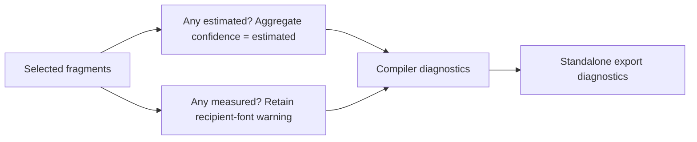

# ConsoleFX review and correction — September 14, 2026

> Historical candidate receipt. Later approval and delivery of ADR-0016/0017/0018
> are recorded in the [workbench implementation/release receipt](workbench-implementation-evidence.md).
> Proposed/pending statements below describe this earlier checkpoint.

**One Spec finding was fixed. The follow-up source reviews found no remaining
actionable issues.**

The review covered public main `77c6e3d` through the locally reviewed candidate
`b35bc3f`, including both [Round 3](architecture-round-3.md) and
[Round 4](architecture-round-4.md). The original candidate is preserved in its
worktree. This follow-up has its own branch and evidence.

## Review result

| Axis | Initial review | After correction |
| --- | --- | --- |
| Standards | No actionable finding | No actionable finding |
| Spec | RV-01: mixed measured/estimated output lost its recipient-font warning | Fixed in `aadb488`; no remaining actionable finding |

**RV-01 — preserve both kinds of uncertainty.**

- The existing partial `letterpress` fixture measures larger text while smaller
  slots retain estimated bounds.
- Aggregate confidence correctly becomes `estimated`. The planner used that
  aggregate to decide whether to warn about recipient fonts, so the warning
  disappeared even though the output still used local measurements.
- The planner now emits `platform-font-variation` whenever any selected fragment
  is measured. `unverified-font-metrics` and aggregate estimated confidence remain.
- The existing regression verifies both qualities and both diagnostic codes in
  compiled output and standalone export. No additional test case or new runner
  was introduced.
- `8ff0d6a` selects explicit reduced motion in the exporter assertion, correcting
  the fixture's `CompileOptions`/`ExportOptions` type mismatch before final checks.

The fix follows [ADR-0015](../adrs/0015-separate-content-fit-from-output-sizing.md)
and the [fitting specification](responsive-fitting-spec.md#core-and-exports).
Accepted ADR-0002, ADR-0004, ADR-0005 and ADR-0009 also govern the unchanged
pure-compilation, package ownership, diagnostic and verification contracts.
No new ADR or visual approval is required.

## Verification

Final source: `8ff0d6a894d465b91a0d7e48b3617c118dd127cd`.
The [verification receipt](review-20260914-verification.json) records commands,
input/artifact fingerprints, environments, observation times and limitations.

- Formatting, lint, types and 353 Vitest 4 cases pass.
- Package contents, bundle budgets and the prepared studio production build pass.
- All 94 desktop/narrow studio cases and three packed-consumer journeys pass,
  alongside isolated JS/TS/React checks and the packed Next production build.

The build ran at `aadb488`. The later `8ff0d6a` change affects only a test
argument; runtime inputs match the build. Final checks use that corrected source.
Raw logs and the owned browser profile remain local. Source review is separate
from executed checks and from later CI, publication and hosted observations.

Final evidence review corrected two documentation findings: RV-03 classifies
the executed offline install as `local`, retaining the original receipt and an
explicit correction record. RV-04 gives preservation and browser cleanup their
own observations, times, harness fingerprints and baseline hashes. Those
corrections required no application change or repeated runtime test.

## Integration status

Core 0.1.1 is now `f23cf219…`; React 0.1.1 remains `f0bcd68d…`.
Full hashes are in the receipt. Previous package approval does not cover these
new core bytes. The prior candidate, all 17 earlier worktree HEAD/index pairs
and the original root files are preserved.

Public push/PR/merge and the resulting Git-triggered Vercel deployment remain
pending exact-candidate approval. This review performs no external mutation.
Proposed ADR-0016/0017 and workbench implementation remain pending. Participant,
physical-device and Safari observations remain unobserved; screen-reader review
remains nonblocking under ADR-0013.
