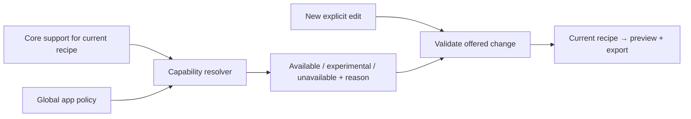

# Workbench internal contract

**One catalogue for discovery. One recipe for editing, preview and export.**

Status: Approved for implementation, 2026-09-14. Read the
[short proposal](workbench-proposal.md) first. This is the implementation
companion, not a new public package API.

## 1. Keep ownership clear

| Owner | Knows | Does not own |
| --- | --- | --- |
| Core package | Valid scenes, profiles, slots, renderer/motion support, fitting, serialization, diagnostics | Categories, routes, sidebar state, browser geometry |
| App catalogue | Examples, category assignment, variants, creation defaults, supported editor controls | A second renderer, document history, remote plugins |
| Existing studio session | Current recipe, explicit edits, Undo/Redo, draft/import recovery | Catalogue labels as persisted document meaning |
| Workbench shell | Sidebar filters, panels, URL intent, confirmation UI | Independent copies of the current recipe |
| Preview/export features | Compile the current recipe and display/copy its result | Catalogue-specific output generation or implicit logging |

The catalogue belongs under `apps/studio/src/features/examples/`. It consumes
public core entrypoints. Routes compose existing features; they do not acquire
their own compiler, storage layer or conditional preset implementations.

## 2. Model only what has a current caller

Approved internal shape; names may be refined without changing these rules:

```ts
type ExampleDefinition = {
  readonly id: ExampleId;
  readonly category: CategoryId;
  readonly family?: string;
  readonly name: string;
  readonly purpose: string;
  readonly tags: readonly string[];
  readonly sampleData: boolean;
  readonly createRecipe: () => RenderRecipeV1;
};

// Published to app views after resolving the example's recipe.
type ExampleCapabilities = Readonly<Record<CapabilityId, CapabilityState>>;

type CapabilityState =
  | { readonly status: "available" }
  | { readonly status: "experimental"; readonly reason: string }
  | { readonly status: "unavailable"; readonly reason: string };

// Two catalogue entrypoints; these are app-owned, not npm exports.
listCatalogue(): ReadonlyCatalogue;
resolveExample(
  input: { exampleId: string } | { recipe: unknown },
): CatalogueResult;
```

- `ReadonlyCatalogue` supplies stable categories, example metadata and curated
  hero selections. Factories remain internal and are materialized on demand.
- A successful `CatalogueResult` contains a validated recipe and a complete,
  read-only control description with support, bounds and reasons. Failure
  contains typed issues such as `unknown-example` or `invalid-recipe`; it never
  substitutes another example silently. Structurally valid but unrenderable
  recipes remain successful editable results with compilation diagnostics.
- Resolving an example applies creation defaults once. Resolving a supplied
  recipe preserves its explicit settings and derives controls from its data.
- Every example exposes a derived capability set to views. Intrinsic limits
  come from its current scene/profile, not a separate `canAnimate` flag. No
  initial example needs an additional editorial restriction, so omit that
  unused extension point. Imports receive the same feature rules.
- No registry server, dynamic plugin loader, generic rules language or public
  registration API is needed. Repository-owned definitions are enough.

### The common path

```text
listCatalogue()                         → sidebar and hero metadata
resolveExample({ exampleId })           → candidate recipe + controls
session requests a confirmed load       → one undoable document replacement
resolveExample({ recipe: current })     → controls after edits or imports
compile/export(current)                → corresponding output and code
```

Keep `originExampleId` as optional discovery context only. It must never
override the current recipe. An imported scene without an ID remains fully
editable, and an edited preset cannot retain controls its current data no
longer supports.

## 3. Resolve availability separately from settings



| Rule | Result |
| --- | --- |
| Core cannot render a feature | Unavailable, even if app policy requests it |
| Core marks a feature experimental | UI cannot promote it to established support |
| Global policy disables a control | Do not offer new edits through it; preserve an existing saved choice |
| A scene/profile limits a control | Show its actual bound and reason, including after import |
| User explicitly chooses Off or a fixed size | Preserve it; a later default change does not turn it back on |
| Category or style tag changes | Discovery changes; capabilities and saved output do not |

**A disabled control is not an invalid document.** App policy governs offered
editor actions; it does not change core validity or block an existing supported
recipe from static preview/export. Show a retained setting as unavailable to
change, with a reason. Core compilation still decides whether output is valid.
A valid recipe whose selected renderer cannot compile stays editable and
JSON-exportable, with the failing preview/output actions disabled. Never replace
or erase it merely to make a control matrix green. Preview playback additionally
respects reduced motion and explicit activation.

Categories deliberately carry **no permission inheritance**. This keeps future
global changes predictable and avoids “motion enabled in one category,
disabled in another” conflicts for the same recipe. Use purpose-appropriate
creation defaults in the sample recipe where needed.

### Initial control families

| Capability | Ordinary scenes | Cinematic profiles | Closed card presentations |
| --- | --- | --- | --- |
| Content | Lines/runs and text | Text subject to profile glyph/length bounds | Named slots and valid enumerated values |
| Typography | Supported text styles | Only exposed profile parameters; no arbitrary font substitution | Owned by presentation; explain Detach before free styling |
| Effects | Compatible effect descriptors | Closed profile controls | Closed presentation; arbitrary effects unavailable |
| Motion | Only compatible effects/renderers; experimental status retained | Unavailable under ADR-0012 | Unavailable under ADR-0014 |
| Content fitting | Explicit `fit/v2` request | Bounded glyph/paint fitting | Approved standard/compact layouts |
| Output sizing | SVG carrier support determines availability | SVG carrier support determines availability | SVG carrier support determines availability |

Motion support does not mean motion is playing. Preview Play is transient;
export motion is an explicit saved choice. Hero and example selection remain
silent. Only **Test in console** emits, exactly once.

**Future global animation:** implement/qualify core support first, expose it
through descriptors, update shared policy, and retain explicit saved choices.
Static versioned profiles need approved successors or new profiles; a catalogue
flag cannot redefine `cinematic/v1` or a closed card's contract.

## 4. Make automatic sizing explicit

New catalogue entries open with automatic sizing enabled. Internally this is
an existing recipe, not a new `responsive: true` compiler flag:

| Setting | Creation rule |
| --- | --- |
| Renderer/target | `svg` / `chromium` for new workbench examples |
| Layout | `fit/v2`; explicit bounded export width (960 px cards, at least 1080 px ordinary flow, authored cinematic width), bounded maximum height, `variant: "auto"`, and a readable minimum font size |
| Overflow | Preserve all content. Use an existing supported fitting policy per profile; impossible requests remain visible errors. |
| Carrier | `container-experimental`, bounded by the chosen export width, complete native-text caption |
| Motion | Static export by default; explicit preview/export activation where supported |

- Central defaults cover ordinary scenes. Profile-specific fitting values
  belong in one profile policy, not repeated per catalogue entry. Use approved
  compact cards only; never invent a new compact visual reference implicitly.
- The catalogue contract matrix must prove every initial recipe can use these
  defaults, or report a concrete unsupported case before implementation is
  called complete. A silent per-example opt-out would violate this proposal.
- The preview may simulate narrow/wide containers without editing the recipe.
  **Use this width for export** is an explicit, undoable fitting change.
- SVG carrier scaling does not rerun the layout algorithm after printing.
  Native width/readability remains unknown; retain the diagnostic and caption.
- Switching to CSS/text presents an explicit choice to remove incompatible SVG
  options as one history entry. Cancel preserves the complete previous recipe.

Imported recipes retain fixed/absent sizing and fitting settings. Legacy raw
scenes retain their established conversion behavior. **Enable automatic
sizing** converts existing work only after an explicit user action; Undo
restores the exact original. Save materialized `RenderRecipeV1` options, not a
pointer to a default that could change later.

No preview resize writes a draft, replaces an export, logs, measures DevTools
or registers an output redraw loop. Local font measurement stays an explicit,
temporary observation and never promises a recipient uses the same font.

## 5. Treat navigation as intent, not document data

Canonical entry: `/studio/?example=preset%3AlightningMetal`. Optional
`category=brand` initializes browsing. IDs remain stable when names/order move.
Existing `#scene=` payloads keep their parser and size limits.

| Incoming action | Required behavior |
| --- | --- |
| `/studio/` without explicit content | Automatically resume a valid draft; otherwise open the default cinematic example |
| Valid shared payload and an example query | Shared content wins. Do not also load the example. |
| Invalid explicit shared payload | Explain the error and preserve/resume valid work; do not replace it with the query example |
| Explicit example and conflicting valid work | Show current and incoming labels; Load is one undo step, Cancel preserves work |
| Unknown example/category | Show an actionable discovery error; preserve the document and allow All examples |
| Category, search or panel change | Change browsing/session UI only; no document reset, draft write or console call |

**URL and history rules**

1. Validate and materialize a candidate before presenting a replacement.
2. Commit its URL only after the user accepts the load. Re-selecting the
   unchanged example is a no-op; edited work still requires the load decision.
3. Browser Back/Forward supplies navigation intent through the same conflict
   handling. Cancel restores the last accepted URL; it does not undo edits.
4. Loading a recipe creates one bounded document-history entry. Search text,
   drawer state and slider movement never create document-history entries.
5. Undo/Redo restores recipe content/options and reconciles discovery context;
   it must not trigger a second load from the URL.

Preserve navigation through a valid shared fragment when redirecting old
`/#playground` entry points. Returning from Docs resumes the draft. Existing
import, reset confirmation, clear-draft recovery, queued storage-write and
invalid-storage protections remain owned by the session/persistence features.

An example click is one recipe load across hero, sidebar and direct links.
There is no separate landing document or hidden editor with competing autosave.

## 6. Pair real output with useful code

- Landing code is the complete package recipe for its selected example,
  including its materialized options. It must recreate the same scene/output.
  Do not show truncated “illustrative” code as something Copy can execute.
- Workbench offers complete standalone output plus existing TypeScript,
  React, Next and JSON formats. Copy uses the shown complete source.
- Both views consume the same recipe through existing compiler/codegen paths.
  Compilation errors disable affected export actions and preserve editable data.
- Tabs implement focus/selection semantics. The reveal is keyboard operable;
  full Output/Code buttons work without dragging. Mobile uses complete panels.
- Preview/code clipping is purely presentational. Text selection, copy actions,
  diagnostic access and visible focus must remain available. No automatic
  slider movement, ambient output animation or hidden focusable content.

Label browser previews as previews. Actual DevTools captures and qualification
receipts remain separate evidence. The comparison itself never executes
displayed code.

Use the selected [amicro adaptations](workbench-interactions.md) for CTA,
copy/check, active-tab and panel transitions. They share existing app state and
the page-effects policy. Clipboard success remains an actual operation result;
hover cannot set it. These source adaptations add no renderer capability or
public-package dependency.

## 7. Add features without page surgery

| Change | Expected edit scope | Owning test |
| --- | --- | --- |
| New example with existing behavior | One catalogue definition and recipe | Automatic full-catalogue contract matrix |
| New category | Category metadata and example assignments | Unique IDs, valid assignments and routing contracts |
| Another variant | Its stable ID/recipe and existing family membership | Same matrix; no new browser journey unless interaction differs |
| New editor capability | Core descriptor/support, shared resolver, one control | Capability contract plus one browser interaction |
| Wider motion availability | Supported core/profile change, policy, qualification | Owning renderer/native proof and motion-control contract |

Prefer three focused modules—catalogue, existing session, existing
preview/export—over a single hook owning factories, navigation, storage and
rendering. This preserves the useful part of the simplest catalogue design
while avoiding a new all-purpose workbench controller.

The catalogue/compiler dependencies are in-process. Storage already has a
local-substitutable boundary. Actual DevTools is external evidence. None of
these calls needs an invented service interface or a remote catalogue backend.

## 8. Acceptance checks

| ID | Observable result | Proof owner |
| --- | --- | --- |
| WB-01 | All 43 entries appear once in the category map; old names remain searchable | Catalogue contracts |
| WB-02 | Categories, hero selections and sidebar derive from the same inventory | Catalogue contracts; representative navigation journey |
| WB-03 | Adding a known-behavior example needs no page/control branch | Source review and catalogue matrix |
| WB-04 | Imported/edited recipes get truthful controls independent of selected example ID | Resolver contracts |
| WB-05 | Unsupported/experimental features cannot be enabled/promoted by tags or policy | Resolver/core contracts |
| WB-06 | All newly opened examples receive explicit fitting and automatic SVG sizing; saved work stays stable | Catalogue/recipe contracts |
| WB-07 | Resize simulation leaves code, document history and stored recipe unchanged | Session contract and representative resize journey |
| WB-08 | Renderer conversion, load, Undo/Redo, invalid links and shared/draft conflicts preserve valid work | Session contracts and navigation journey |
| WB-09 | Lightning Metal leads the hero; all four cinematic variants are reachable; six use-case tabs agree with navigation | Browser journey and appearance review |
| WB-10 | Output and complete source reproduce the same recipe; only explicit Test logs once | Codegen contracts and copy/test journey |
| WB-11 | Keyboard, narrow layout and reduced motion preserve tabs, reveal, editing and focus | Browser/accessibility journey |
| WB-12 | Landing is short; full discovery/editor lives in Studio; integration/video lives in Docs; old links remain useful | Route/content journey |

Use the [testing strategy](testing-strategy.md): run at completed milestones,
not after every edit. Page-only changes reuse unchanged renderer qualification;
new default combinations and changed geometry/motion need their owning
evidence. The screen-reader follow-up stays nonblocking under ADR-0013.

## 9. Resolve existing specification conflicts

| Existing intent | Proposed change | Decision |
| --- | --- | --- |
| Base spec §7.1/7.2 and AC-10 require an integrated landing/editor flow | Separate short landing and persistent `/studio/` workbench | Accepted ADR-0016; affected website/spec requirements reconciled |
| Existing website specs put galleries/workbench/integration in the landing narrative | Move full discovery to Studio and integration/video to Docs | Accepted ADR-0016; retain truthful value/copy/recovery requirements |
| ADR-0015 and fitting spec §7 make container sizing explicit opt-in | Default it on only for new workbench examples, retain experimental status and saved explicit choices | Accepted ADR-0017; narrow successor for new-example creation |
| ADR-0012/0014 define static closed profiles | Keep them static; metadata cannot add motion | No intent change in this proposal |

ADR-0016 and ADR-0017 are **Accepted** as of 2026-09-14. ADR-0015 carries a
reciprocal narrow successor note. No new scene/recipe version, package boundary, font service,
measurement side effect or logging behavior is proposed.

Accepted [ADR-0018](../adrs/0018-add-versioned-floor-preserving-fitting.md) selects v2 for new examples. Existing v1 recipes and measured compact paths remain unchanged. Full card artwork is used initially so its smallest authored fields reach the 12 px floor; compact fitting remains an explicit choice. No safe cell or readable floor is relaxed to force a fit.
