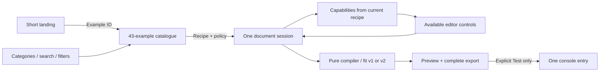

# Workbench and fitting v2 — implementation receipt

**The approved pages and all 43 examples are implemented.** Release 0.2.0 under
`next` is authorized. Source, local checks, native Console observations, CI,
registry publication and public hosting are recorded separately below.

Date: 2026-09-14. Baseline: `9f8cca0a5534c5b6cf503098463a0ee56beae288`.
Owner: ConsoleFX maintainer. Working branch: `feat/console-fx-workbench-20260914`.

## What changed

- **Landing:** Lightning Metal leads a short introduction. All four cinematic
  designs are available. Six use-case tabs compare actual output with its complete
  recipe. Keyboard controls and full Output/Code views accompany the slider.
- **Studio:** one persistent sidebar, editor and preview. Find the 43 examples by
  six developer-job categories, text search, five visual styles or capabilities.
- **Docs:** integration recipes and a new 44.7-second recorded walkthrough,
  WebM/MP4, poster, eight caption cues, transcript and native playback controls.
- **Capabilities:** resolve from the current recipe, public descriptors and policy.
  Mixed scenes retain motion on eligible ordinary runs; cinematic/card runs remain
  static. Disabled options preserve saved work and give a reason.
- **New-example sizing:** explicit SVG, `fit/v2` and `container-experimental`.
  Imported/raw/saved settings stay unchanged. Conversion, replacement and imports
  remain undoable. Resizing the preview changes neither the recipe nor export.
- **Recovery:** draft/shared-link conflicts, navigation, Undo/Redo, Reset and
  asynchronous imports remain under one document-session owner. Opening a renderer
  confirmation invalidates an older pending import before it can replace work.
- **amicro:** adapted keyboard tabs and verified clipboard-success feedback.
  Its MIT notice is shipped. No Motion/Tailwind dependency was introduced.
- **Technology documentation:** separate [stack and complete dependency inventory](../technology/README.md).

## Governing decisions

- ADR-0002–0007: pure compilation, public package boundaries, validated output,
  actual DevTools qualification and local recovery.
- ADR-0008–0010: pinned toolchain, proportional milestone checks and explicit
  package/hosting proof.
- ADR-0012–0015: static cinematic/card profiles, nonblocking screen-reader follow-up,
  preserved fitting/sizing and recipe boundaries.
- **ADR-0016, ADR-0017 and ADR-0018:** explicitly approved by the maintainer on
  September 14. No acceptance was inferred from a file's presence.

## Acceptance map

| Criteria | Implementation and proof owner |
| --- | --- |
| WB-01–03 | One typed inventory of 23 presets, six featured and 14 reference examples; category/style/search tests and representative sidebar journeys. Adding a known-behavior recipe needs no page/control branch. |
| WB-04–05 | Resolver contracts cover per-run motion, renderer conversion and every policy family. Static output is preserved when controls are unavailable; policy cannot grant compiler support. |
| WB-06 | The complete 43-example matrix checks explicit v2/automatic defaults, complete text, paint bounds, floors, overlap, round trips, silent compilation and one-call exports. Saved explicit options remain intact. |
| WB-07 | Preview sizing stays outside session history/recipe state. Browser fitting journeys verify unchanged exported source and explicit optional measurements. |
| WB-08 | Session/navigation contracts and browser recovery journeys cover imports, invalid links, category history, shared/draft conflicts, renderer confirmation, Undo/Redo and Reset. |
| WB-09 | Four cinematic designs, Lightning default and six semantic tabs share the catalogue's category/example mapping. Desktop/narrow captures and keyboard journeys cover the comparison. |
| WB-10 | Complete output/code agreement is tested in catalogue/codegen contracts. Actual recorded copying checks clipboard equality; Test emits exactly once. |
| WB-11 | Desktop/narrow browser journeys include keyboard tabs, drawer Escape/focus, mounted editing panels, reduced motion, import recovery, axe checks and clipboard failure. These are not physical-device or screen-reader observations. |
| WB-12 | `/`, `/studio/` and `/docs/` have separate purposes; old landing anchors still lead to useful destinations. The updated Docs video loads only on request. |

## Fitting and package boundary

- `fit/v2` uses at most 16 candidates and clamps fonts individually at readable
  floors. Paint stays within the original safe cells, including status/divider/
  ornament exclusions. Impossible input still fails or uses explicit fallback.
- Shaping requests remain bounded at 512; cache data at 512 KiB; serialized
  measurement batches at 64 KiB. Fonts are measured only on explicit request.
- **93 v1 compatibility cases** retain outputs, reports, exports, failures and
  fallbacks. All public descriptors retain their previous values: 13 effects,
  ten presentations and 69 card slots. Old readers reject v2; measurement identities
  include the selected algorithm.
- The first complete compiler bundle exceeded its existing 25 KiB limit. The
  correction factors repeated private metadata, keeps editor-only metadata lazy,
  and puts speculative wrapping requests in preflight. No budget was increased.
- Exact native arguments, preview data and standalone code match before/after
  that correction across all 43 examples. The raw parity receipt is retained with
  the local evidence.
- Container sizing is **experimental**. Unknown native display width cannot
  promise a readable image font size. Diagnostics and complete native text captions
  remain available; the artboard floor is not a portability guarantee.

## Verification stages

| Stage | Result and limitation |
| --- | --- |
| Source/static | Independent Standards and Spec reviews closed their actionable findings. Documentation/format/link checks are recorded with the evidence. |
| Local source | Vitest 4.1.11: **413 tests / 26 files passed**. Types, lint and formatting passed. Security/recovery/compatibility regressions were retained. |
| Local production build | Next static export and Vercel preparation passed: 48 files, five inline-script hashes, 480-byte CSP and 99 third-party notices. No build step deployed. |
| Local browser | **51 desktop/narrow journeys passed**, including the new video's playback/captions. Narrow viewports are emulated. |
| Packed installation | JS, TypeScript, React SSR/lifecycle, displayed website recipes, Next build/SSR and **three Next browser journeys passed** against installed 0.2.0 tarballs. The oracle resolves public exports from that installation. |
| Package size | Minimal CSS **9,065 / 10,240** gzip bytes; complete CSS **25,552 / 25,600**; SVG **25,554 / 25,600**. No framework/codegen/preset leakage. Headroom for the complete compiler is small and remains enforced. |
| Native Windows Console | All 43 new defaults passed actual Chrome for Testing Stable 153.0.8010.36 and Edge Stable 152.0.4191.77 on Windows 11 25H2 build 26220.9223. One call, exact arguments, full captions and native captures; inspect the native receipt for resizing observations. |
| CI | Pending source push; record the exact PR/main run before claiming CI success. |
| Publication/install | Pending 0.2.0 publication and registry readback. Authenticated npm preflight succeeded as the scope owner. Local tarballs are not published packages. |
| Deployed/production | Pending this implementation's Git-connected deployment and public verification. The pre-task production deployment is an earlier site. |

The [evidence index](../evidence/workbench/2026-09-14/README.md) records exact
artifact hashes, browser metadata and local proof paths. Toolchain: Linux/NixOS
WSL2, Node 24.20.0, pnpm 12.3.4, TypeScript 6.0.3, Next 16.3.4,
Playwright 1.63.0 and local Chromium 153.0.8010.12.

## Remaining external observations

- Five-developer study, including at least two people new to ConsoleFX.
- Integrated-GPU laptop and physical-phone performance observations.
- Real Safari website journeys.
- Screen-reader review remains a **nonblocking follow-up** under ADR-0013.

These are inherited observation gaps. This receipt does not turn automated
checks into participant, device, Safari or screen-reader evidence.
