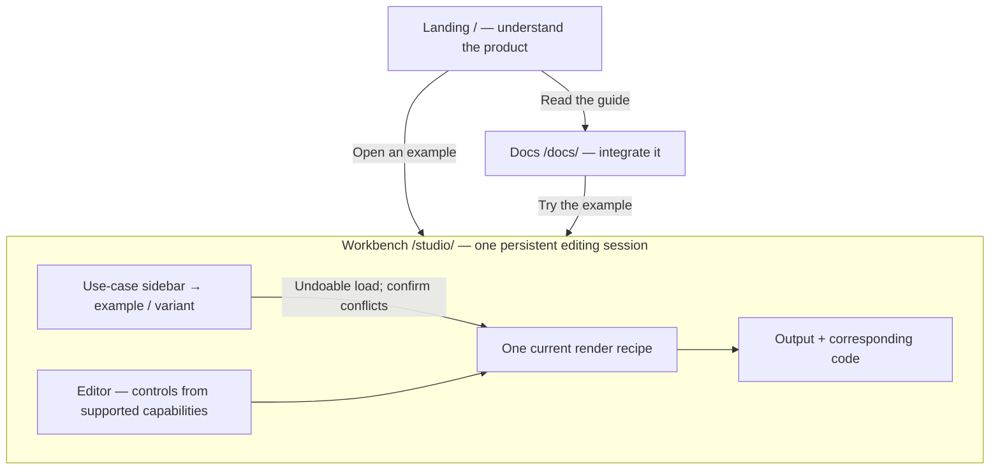

# ConsoleFX: a short landing page and a focused workbench

**Start with the six categories below. They are the foundation of this proposal.**

Status: **Approved for implementation — 2026-09-14.**
Date: 2026-09-13. Reading time: about four minutes.

The test strategy and cleanup are a separate prerequisite, now merged in
[PR #22](https://github.com/servrox/console-fx/pull/22). This document records the approved
product structure. The [implementation receipt](workbench-implementation-evidence.md)
tracks source, verification and the live release separately.

The separate [technology and dependency section](../technology/README.md)
documents the current stack and selected UI sources, including amicro.

## 1. Organize by the developer's job

| Sidebar category | The question it answers | Good starting examples |
| --- | --- | --- |
| **Brand & signatures** | “How should this project introduce itself?” | Lightning Metal, the other cinematic signatures, ASCII logo, quiet credits |
| **Debugging & diagnostics** | “What failed, and where should I look?” | Request trace, error with recovery hint, warning |
| **Runtime & environment** | “What is running, and in which context?” | Service ready, environment badges, labels |
| **Builds & releases** | “What did we build or ship?” | Build receipt, release bulletin, completion message |
| **Guides & onboarding** | “What should the developer do next?” | SDK welcome, command card, multiline instructions |
| **Easter eggs & celebrations** | “What small surprise makes this memorable?” | Animated dolphin, decorative animated message |

- Give each example **one primary category**. Search tags can connect related
  uses: a release celebration can also appear when searching “easter egg.”
- Keep **Cinematic, ASCII, Neon, Card and Minimal** as style filters. They
  describe appearance, not the developer's task.
- Derive capability filters such as **Motion available** and **Named fields**
  from actual support. A visual tag never enables an editor control.
- Group related recipes as variants. Keep every existing example accessible.
- Use **All examples** as a discovery view, not a seventh category.

**Why six?** Five broad groups made diagnostics, runtime information and build
results harder to distinguish. Seven split onboarding from instructions too
early. These six give today's examples useful homes and leave room for growth.

The [catalogue map](workbench-catalogue.md) assigns all **43 current entries**:
23 core presets, six featured recipes and 14 reference recipes. They are not 43
independent component types.

## 2. Give each page one purpose

| Page | Purpose | Main content |
| --- | --- | --- |
| `/` | Understand the product quickly | Cinematic hero, use-case tabs, output/code reveal, six category links, short compatibility note and workbench CTA |
| `/studio/` | Find an example and make it yours | Persistent category sidebar, example variants, editor, output/code preview and explicit copy/test actions |
| `/docs/` | Integrate it in a project | Installation, core/React/Next recipes, usage video with transcript, rendering limits and troubleshooting |

- The landing page stops carrying the full editor, complete galleries and
  integration guide. Each section points to its owning page.
- The workbench keeps the editor and preview mounted while categories change.
  Browsing does not discard work or reset controls.
- On narrow screens, the sidebar becomes a drawer. Edit, Output and Code use
  tabs; switching panels preserves the same editing session.
- Keep `/studio/` and `/docs/` compatible. Old `/#playground` links forward to
  the workbench; shared scenes and valid drafts retain their recovery rules.

## 3. Let the cinematic output lead

**Default hero: Brand & signatures → Lightning Metal.**

- Use the same six categories for hero tabs and sidebar navigation. Each tab
  selects one curated example; Brand includes the four cinematic variants.
- Show a draggable **Output / Code** reveal inside the selected tab. Keep
  “Show output,” “Show code” and Copy available without dragging.
- Show real compiled output and complete, copyable recipe code for that same
  example. Offer the complete standalone `console.log` export in the workbench.
- Keep cinematics static, as currently supported. Motion examples play only
  after an explicit action and respect reduced-motion preferences.
- On mobile, use full Output/Code panels instead of a cramped wipe. Keyboard
  users get working tabs and a labelled slider; no control is hidden behind it.

The [Aceternity Compare](https://ui.aceternity.com/components/compare),
[Tabs](https://ui.aceternity.com/components/tabs) and
[component sidebar](https://ui.aceternity.com/components) are interaction
references. Compare is designed around images; code needs selectable text and
a complete reading mode. Adapt the interaction to those needs. Adding its
animation/dependency stack is not a requirement.

**Use amicro for the interaction treatment:** directional CTA feedback,
truthful copy/check states, selected-tab indicators and restrained panel fades.
The [amicro integration choices](workbench-interactions.md) pin the selected
source, required accessibility corrections and attribution. Adapt these small
pieces with existing React/CSS; retain the shared tabs and Compare structure.

## 4. Make capabilities truthful and extensible

**A category helps people find an example. The current recipe determines what
the editor can do.**

| Concept | Responsibility |
| --- | --- |
| Category | The job: debugging, branding, onboarding… |
| Example | Named sample content and an ordinary materialized render recipe |
| Style / variant | A related visual treatment; still has its own stable example ID |
| Capability | Supported controls and limits: text, named fields, typography, motion, fitting, output sizing |
| User choice | The current setting, preserved in the recipe when the existing format supports it |

- One app-owned catalogue feeds the hero, sidebar, search and example picker.
- One capability resolver derives each example's feature set from its recipe
  and core support, then applies shared editor policy. It runs again after
  edits, imports or renderer changes.
- Controls report **available**, **experimental**, or **unavailable with a
  reason**. Availability and the user's on/off choice are separate.
- New examples and categories normally add data. A genuinely new rendering
  feature adds core support and one shared control integration.
- A future “motion for all” policy cannot animate a static profile by itself.
  Core support, qualification and any required ADR successor come first.

The [internal contract](workbench-contract.md) defines precedence, saved state,
errors and the exact changes needed for each extension.

## 5. Enable responsive sizing for every new example

**Recommended default: automatic sizing ON for every newly opened catalogue
example, including cinematic and card examples.**

| Layer | Accepted behavior |
| --- | --- |
| Website layout | Always adapts to the available page space. No feature flag. |
| Content fitting | Every new example receives an explicit `fit/v2` request with readable limits. Approved compact card layouts are eligible. |
| Console output | New workbench examples start in SVG with the existing `container-experimental` carrier enabled and a complete native-text caption. |
| Existing work | Imported recipes and resumed drafts keep their saved settings. Offer an explicit conversion; do not silently change exports. |

- Keep the label honest: **Automatic width · experimental in DevTools**.
  Show the underlying fitting and output-size controls in Advanced.
- Fit against a chosen export frame. Resizing the website must not secretly
  rewrite the exported recipe or create Undo steps.
- The emitted image can scale; it cannot ask DevTools for its width or choose
  a new compact layout after printing. Readability at unknown widths remains
  unknown. Keep the complete text caption.
- CSS/text remain explicit alternatives. Changing renderer explains which
  SVG sizing options must be removed and applies the choice as one undo step.
- Impossible readable fits preserve the document and offer fixed/compact/text
  recovery. Do not truncate fields, hide errors or silently fall back.

This deliberately changes the **app's creation default**, not the public
compiler's defaults. The current contract makes container sizing opt-in;
[Accepted ADR-0017](../adrs/0017-default-new-workbench-examples-to-automatic-svg-sizing.md)
records the narrow change for review. It does not graduate experimental output
or promise responsive console reflow.

## 6. Build in reviewable milestones

1. **Now:** review these documents. Test simplification and Vitest 4 validation
   are recorded separately in the [testing strategy](testing-strategy.md).
2. **After approval:** implement the shared catalogue and capability contract;
   validate all entries with one contract matrix.
3. **Then:** move discovery into the persistent workbench and implement safe
   navigation, draft handling and responsive defaults.
4. **Then:** shorten the landing, add the cinematic hero and adapt Output/Code
   tabs/reveal; move detailed guidance and the video to Docs.
5. **Finalize:** run the owning tests at each completed milestone and the
   required final checks once. Record local, CI, native and hosted evidence
   separately.

**Next review:** accept the category map and page/capability contract in
[Accepted ADR-0016](../adrs/0016-organize-discovery-around-an-example-catalogue.md),
and the new-example sizing default in Accepted ADR-0017. Both records were approved on 2026-09-14; implementation is authorized.

Accepted [ADR-0018](../adrs/0018-add-versioned-floor-preserving-fitting.md) selects v2 for new examples. Existing v1 recipes and measured compact paths remain unchanged. Full card artwork is used initially so its smallest authored fields reach the 12 px floor; compact fitting remains an explicit choice. No safe cell or readable floor is relaxed to force a fit.
