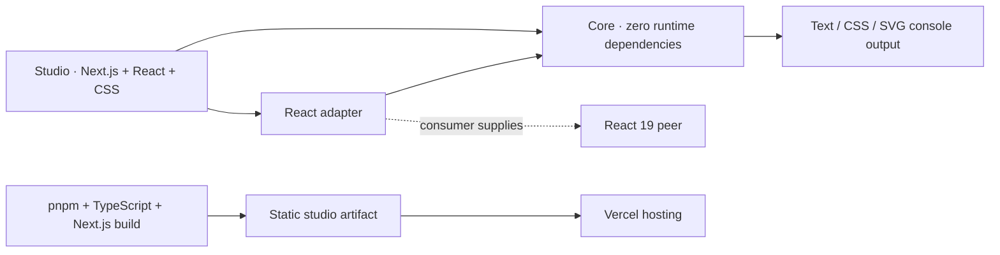

# Technology & dependencies

**Start here to see what ConsoleFX uses, why it is needed and where it belongs.**

Source snapshot: **2026-09-13**, following the merged Vitest 4 maintenance and
0.1.1 package preparation in PR #22.
Versions describe this checkout; release and deployment status belongs in the
[release ledger](../releasing.md).

## Read the section

- [Direct dependencies](dependencies.md): all **22 third-party packages** declared
  by the active manifests, with exact versions, roles and ownership.
- [Complete lockfile inventory](dependency-inventory.json): **583 package/version
  entries** — 574 workspace entries and 9 package-manager entries.
- [Testing strategy](../specs/testing-strategy.md): which tool owns each check and
  when to run it.
- [Selected UI sources](#selected-ui-sources): amicro and Aceternity, pending
  product integration.

## What runs where

| Part            | Technology                                   | Responsibility                                                                                    |
| --------------- | -------------------------------------------- | ------------------------------------------------------------------------------------------------- |
| Core library    | TypeScript → ESM JavaScript and declarations | Scene validation, effects, fitting, renderers and exports; **no runtime dependencies**            |
| React adapter   | React peer + public core entrypoints         | Hooks, opt-in emission and reusable preview; React stays supplied by the consumer                 |
| Studio          | Next.js App Router, React and authored CSS   | Static pages plus client-side editing, previews, local drafts and export actions                  |
| Console output  | Browser console formatting, CSS and SVG      | Generated output and its complete text caption; standalone exports need no installed package      |
| Hosted artifact | Next.js static export → Vercel Build Output  | Static HTML, JavaScript, CSS and media; no application server is required for the deployed studio |

Dependency arrows follow [ADR-0004](../adrs/0004-separate-core-react-adapter-and-studio.md).
The [Next.js configuration](../../apps/studio/next.config.ts) selects static
export. The [artifact preparer](../../scripts/prepare-vercel.mjs) prepares hosting
output. Generated styles/SVG use ConsoleFX's own compiler, not an external
graphics or animation library.

## Runtime and development tools

| Tool / environment                 | Version or policy                                             | Use                                                                                     |
| ---------------------------------- | ------------------------------------------------------------- | --------------------------------------------------------------------------------------- |
| Node.js                            | CI/local baseline **24.20.0**; manifest range `>=24.15.0 <25` | Development, scripts, builds and package validation                                     |
| pnpm                               | **12.3.4**, pinned in `packageManager` and CI                 | Workspace installs, lockfile and script orchestration                                   |
| NixOS inside WSL2                  | Distribution `nixos`; host-managed packages                   | Canonical Linux development environment; project worktrees stay on the Linux filesystem |
| Git                                | NixOS-managed; no repository version pin                      | Source control and release snapshots                                                    |
| Corepack                           | Build-host tool; no repository version pin                    | Invokes the pinned pnpm in the Vercel install/build commands                            |
| Python                             | Host-managed; no repository version pin                       | [Local browser-test server](../../scripts/serve-studio.py), using only the standard library, serves the prepared artifact and its generated global headers |
| FFmpeg                             | **8.1.2 in the dated recording receipt**                      | Encodes the actual studio walkthrough into MP4, WebM and its poster                     |
| Bun                                | **1.4.2 in the dated consumer receipt**                       | Additional package-consumption check; pnpm remains the workspace manager                |
| `tar`                              | Host-managed                                                  | Package extraction and artifact validation                                              |
| actionlint                         | **1.7.12 in the dated workflow receipt**                      | Validate GitHub Actions workflow syntax and expressions                                 |
| PowerShell / Windows UI Automation | Windows observation tools; no repository version pin          | Native Chrome/Edge DevTools qualification and capture                                   |

The [workspace policy](../../pnpm-workspace.yaml) pins exact direct dependencies,
enforces engines and peers, and sets a 1,440-minute minimum release age.
Install with `pnpm install --frozen-lockfile --ignore-scripts`; the declared
esbuild, sharp and unrs-resolver build permissions are disabled.
[ADR-0008](../adrs/0008-own-pnpm-and-typescript-toolchain.md) owns the toolchain.

FFmpeg, Bun and actionlint versions are historical observations, not promises
about the current host. See the [video receipt](../specs/usage-video-evidence.md),
[Bun consumer receipt](../evidence/packages/2026-09-11/bun-smoke.json) and
[workflow validation receipt](../publishing.md).

Browser engines installed by Playwright and actual Windows Chrome/Edge are
separate observation environments. Their builds and results belong in
[compatibility evidence](../compatibility.md). Playwright WebKit does not stand
in for a completed real Safari check.

## CI and external services

| Service / action                      | Role                                                                      | Source                                                                              |
| ------------------------------------- | ------------------------------------------------------------------------- | ----------------------------------------------------------------------------------- |
| GitHub repository and Actions         | Source review and validation; Ubuntu 24.04 runner                         | [Validation workflow](../../.github/workflows/validate.yml)                         |
| `actions/checkout` **7.0.1**          | Check out the candidate                                                   | Commit-pinned in the workflow                                                       |
| `actions/setup-node` **7.0.0**        | Set up Node 24.20.0                                                       | Commit-pinned in the workflow                                                       |
| `pnpm/action-setup` **6.1.0**         | Set up pnpm 12.3.4                                                        | Commit-pinned in the workflow                                                       |
| `actions/upload-artifact` **7.0.1**   | Retain validation/package artifacts                                       | Commit-pinned in the workflow                                                       |
| `actions/download-artifact` **8.0.1** | Retrieve the reviewed validation artifacts for publishing                 | Commit-pinned in the [publishing workflow](../../.github/workflows/publish.yml)     |
| Vercel                                | Build and host the static studio in `servroxs-projects/console-fx`        | [Hosting configuration](../../vercel.json); Git-triggered builds enabled for `main` |
| npm registry                          | Publish and install `@servrox/console-fx` and `@servrox/console-fx-react` | [Release process and evidence](../releasing.md)                                     |

GitHub CLI, npm CLI and Vercel CLI are operational clients when release work
needs them; they are not application dependencies and have no repository version
pins. Validation and publishing use separate workflows. The publishing workflow
requires manual dispatch and the recorded release gates; its presence does not
establish configured trusted publishing or a completed publication. Current
publication and production observations belong in the release ledger.

## Selected UI sources

| Source                                                                                                                                                                    | Intended use                                                                                      | Integration status                                                                                                 |
| ------------------------------------------------------------------------------------------------------------------------------------------------------------------------- | ------------------------------------------------------------------------------------------------- | ------------------------------------------------------------------------------------------------------------------ |
| [amicro](https://amicro.vercel.app/)                                                                                                                                      | Directional CTA, truthful copy/check feedback, selected-tab treatment and small panel transitions | **Selected; not installed or shipped.** Adapt the chosen source with existing React/CSS and retain its MIT notice. |
| [Aceternity Compare](https://ui.aceternity.com/components/compare), [Tabs](https://ui.aceternity.com/components/tabs) and [sidebar](https://ui.aceternity.com/components) | Output/code reveal, hero use-case tabs and category discovery                                     | **Interaction references; not installed.** The workbench proposal defines the accessible adaptations.              |

The [amicro integration contract](../specs/workbench-interactions.md) pins source
revision `86b55340bfb939b8e93bb53aa46ba017c3449f1c` and documents deliberate changes
to demo behavior. No Motion, Framer Motion, Tailwind or icon package has been
selected as a new ConsoleFX dependency. Upstream demo dependencies are not
automatically dependencies of an adapted interaction.

The [workbench proposal](../specs/workbench-proposal.md) and Proposed
ADR-0016/0017 retain their existing review checkpoint.

## Inventory and licenses

- The direct package table covers the root, studio, core, React adapter and
  active Next.js consumer example. Workspace links are listed separately.
- The JSON index covers **every package/version key in both YAML documents** of
  the root lockfile, including optional packages for other platforms. It does
  not claim all entries are installed on this host or shipped to a browser.
- The canonical [lockfile](../../pnpm-lock.yaml) retains dependency edges, peer
  contexts and integrity hashes. The index is a searchable version list, not a
  bundle-composition report or a second lockfile.
- Next.js also vendors components inside its distribution. The
  [notice generator](../../scripts/third-party-notices.mjs) collects their
  LICENSE/NOTICE files and the Next.js/React/styled-jsx/SWC notices into the
  built studio's `/licenses.txt`; some notices cover build-only components.
- Archived consumer manifests and lockfiles under `docs/evidence/` document
  dated isolated installs. They are not the active workspace dependency graph;
  see [consumer validation](../../scripts/check-consumers.mjs).

For future copied UI source, retain a checked-in upstream notice and extend the
notice generator. Hand-editing generated `apps/studio/public/licenses.txt` would
be overwritten by the next build. ConsoleFX's own source is [MIT](../../LICENSE).

## Keep this section current

1. When a manifest or tool pin changes, update the direct package table and
   the relevant tool/service row in the same change.
2. Refresh the JSON index from **all** documents in `pnpm-lock.yaml`: retain
   each graph's importer paths and sorted package keys with any `cpu`, `os`
   and `libc` constraints. Recompute the source SHA-256 and counts.
3. Validate the exact manifest union, graph counts, source hash and local links
   at the documentation milestone. Application tests are needed only when the
   affected implementation or dependency contract changes.
4. When a selected source lands, record its actual ownership/version/notice and
   change its status here. Keep deployment claims in the release ledger.

The inventory contains its source format and extraction fields. An ordinary
multi-document YAML reader is sufficient to refresh it; no new project package
or CI lane is required.
